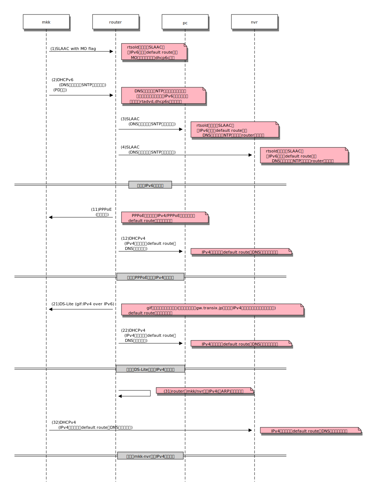
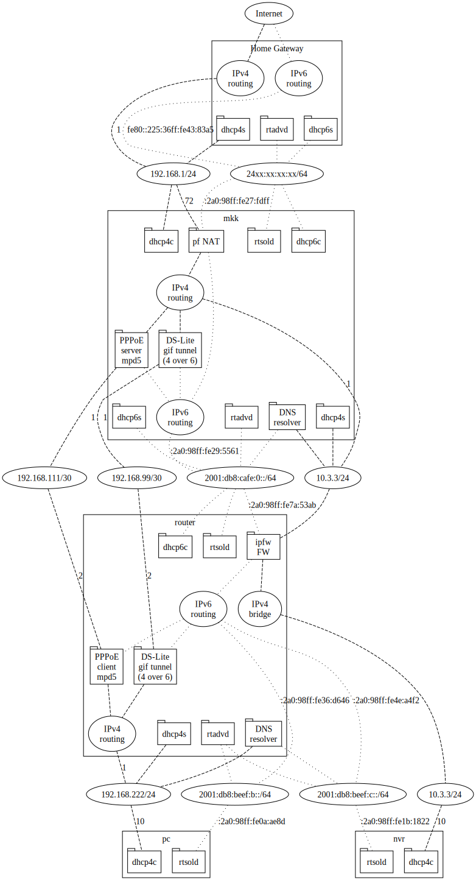
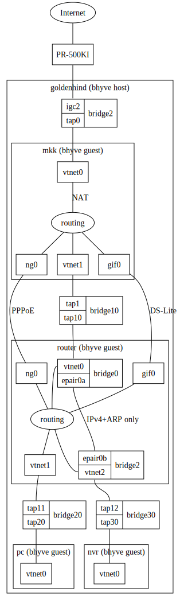

# Flet's もどきのネットワーク

自宅のインターネット接続がFlet'sひかり(ひかり電話あり)で、ホームゲート
ウェイ(HGW)をレンタルしているが、
  1. IPv6のスタティックルートが書けない。
  1. IPv6のACLが書けない(よね?)。
  1. 地味にレンタル料がかかる。
などの理由で、このHGWをあまり気に入ってはいない。

となると、YAMAHA NVR-510のようなひかり電話対応の機種を買ってきて置換す
るのか、NEC IX2105あたりとYAMAHA NV-R500の組み合わせにするか、と言うあ
たりかなとも思うけれど、中古でもそれなりの値段がするし、どうしたもの
か。NVR-500は中古なら安く手に入るので、とりあえずFreeBSDとNVR-500で何
とかならないか、ちょっとやってみるかと思って始めたのが「Flet'sもどきの
ネットワーク」でした。
これが予想通り大変で、まだまだ疑似環境にはなっていなくて、必須の機能だ
けを非常に簡単な形で再現してみたレベルに留まっているが、覚書にしておこ
うと思います。

## 参考になる/したページ

- [技術参考資料: IP通信網サービスのインターフェース 第三分冊](https://www.ntt-east.co.jp/info-st/katsuyou/2019/temp20-1.pdf)

- https://notoken.hatenadiary.com/entry/2020/07/29/004329
- https://www.noblehero.jp/2023/01/13/ひかり電話契約の有無による光回線からのipv6配布/
- https://diary.sorah.jp/2017/02/19/flets-ngn-hikaridenwa-kill-dhcpv6pd
- https://blog.goo.ne.jp/rabbit5151/e/caa953eafd3bd8636c74636da2997605

## 大まかな構成

- ノードとしては、mkk, router, pc, nvr の４ノードで構成する。
- mkk はIP通信網もどきの役割を担い、上流側は自宅LANを介してインターネッ
  トへ繋がり、下流側に残りの３ノードを置く。
- routerは、mkkの直下に接続され、ホームゲートウェイの役割を果たす。
- pcは、自宅LAN内にある普通のPC端末の役割を果たす。
- nvrは、自宅内でひかり電話を終端する装置(例えばYAMAHA NVR-510のひかり
  電話機能の部分)の役割を果たす。
- ただし、いずれのノードでもTCP/IPとしての通信ができるところまでを実験
  するので、例えばnvrでSIPサーバを動かす訳ではなく、pingが通りDNSが牽
  ける程度までの実験である。

                   Internet
                       |
                      HGW
                       | 自宅LAN
            +----------+-------------------+
            |                              |
           mkk                        自宅LAN上のPCなど
            |
          router --------+
            |            |
           pc           nvr

- mkkでは上流の自宅LANと接続するインタフェースでIPv4, IPv6のアドレス変
  換を行う。こうすることで、フレッツもどきの実験ネットワーク内で任意の
  アドレスを使用することができる。

## おおまかな流れ

- mkk以下のフレッツもどきネットワークでは、おおよそ次の図のようにアドレスを
配り通信できるようにしていく。

  

### (1) IPv6アドレスの割り当て
- フレッツもどきネットワークでIPv6による接続ができるようにする流れは、
大略次の通り。
#### mkk
- まず、mkkの下流側インタフェースで、rtadvdによるRouter Advertisement
  (RA)を行う。このRAでは、OフラグとMフラグが立っていて、それぞれ、追加
  情報とPrefix Delegation (PD)情報をDHCPv6で取得することを促す。ここで
  追加情報と言っているのは、フレッツの仕様に倣ってDNSリゾルバとSNTPサー
  バのアドレスやサーチドメインを想定しており、PD情報と言っているのはひ
  かり電話ありの場合にPDで割り当てられるIPv6プレフィクスとプレフィクス
  長である。
- DHCPv6で情報を取りに来いと下流に指示したので、mkkの下流側インタフェー
  スでdhcp6sでDHCPv6サーバを立てておく。追加情報・PD情報を提供すること
  はもちろんである。
#### router
- routerではrtsoldによってrouter solicitationを送出してRAの送出を促し、
  自ノードの上流側のインタフェースにIPv6アドレスを設定する。
- この時、M/Oフラグに対応するためにrtsoldのM/Oオプションでスクリプトを
  指定しておき、受信したRAでこれらフラグが立っていた場合に必要な処理
  (dhcp6cを使って問合せを行う契機を与えるなど)を行う。また、Aオプションに指定した
  スクリプトでIPv6のデフォルトルートを設定する。
- dhcp6cでは、追加情報を元にしてDNSリゾルバやNTPサーバの設定を自ノード
  で行う。また、routerからpcやnvr向けにDNSリゾルバを起動する。
  さらに、PD情報に対応して、自ノードの下流側インタフェースにIPv6
  アドレスを設定したり、下流向けのrtadvd, dhcp6sの設定を行って起動する。
#### pc, nvr
- pcとnvrでは、rtsoldを起動してrouterからIPv6アドレスをもらう。
- RAのOフラグが立っているので、dhcpクライアントを起動して追加情報をもらう。

### (2)IPv4アドレスの割り当て
- IPv6での接続性を確保した後は、IPv4での接続を確立することになる。
- これには、(a)PPPoEによる方法と(b)IPv4 over IPv6による方法がある。
- どちらの場合でも、routerからmkkに対してIPv4の経路を確保して、ここにpcやnvrを接続することになる。
- PPPoEを使うのは元々の東西NTT地域会社の仕様だが、混み合って遅いということでIPv4 over IPv6のサービスが使えるようになった。
- IPv4 over IPv6の接続にはISP(というかイネーブラ)によって
[MAP-E(v6プラス)](https://www.jpix.ad.jp/service/?p=3444)
と
[DS-Lite(transix)](https://www.mfeed.ad.jp/transix/dslite/dslite.html)
のいずれかを採用しているが、ここではうちのISPが採用しているDS-Liteの例を扱う。

### (2a)PPPoEによるIPv4接続
### (2b)IPv4 over IPv6 (gif)によるIPv4接続
### (3)ひかり電話の接続

### ネットワーク構成

  
  

