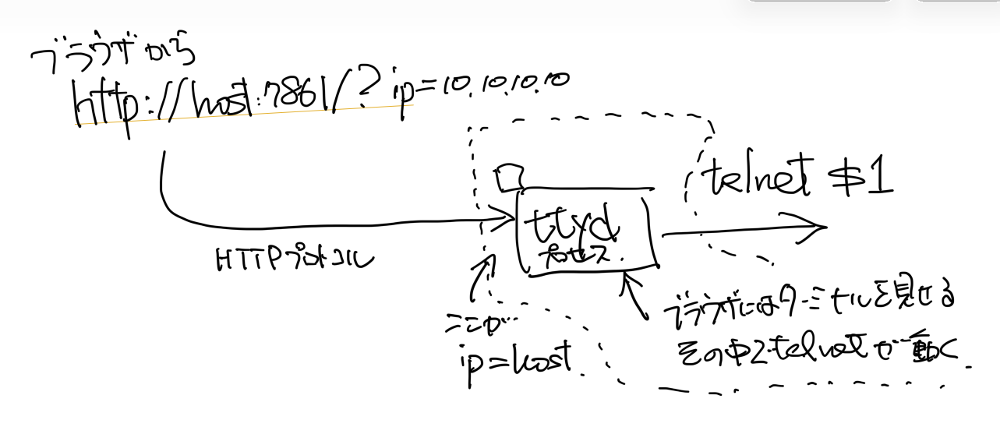
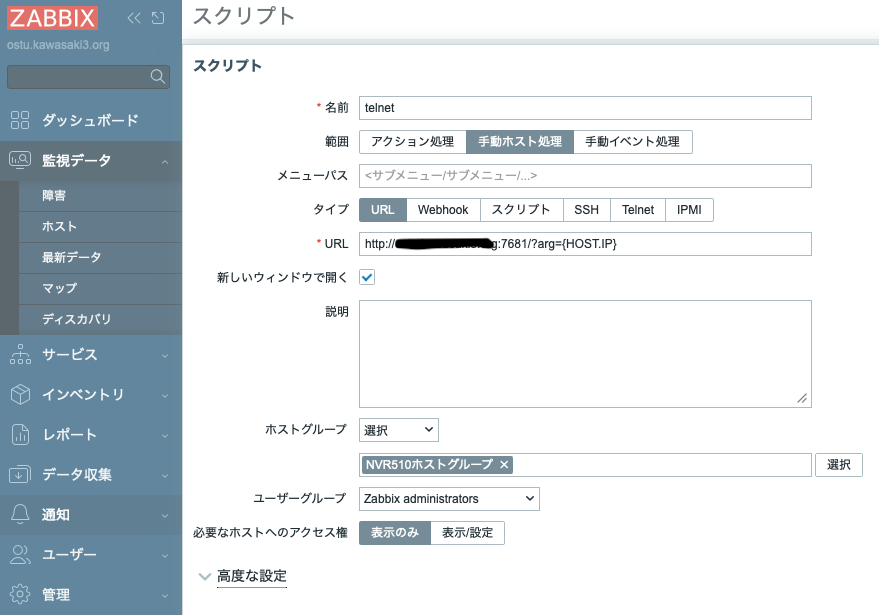

# Zabbix ネットワークマップにインタラクティブシェルを

## 今回のまとめ

- 使用環境
  - [Ubuntu 24.04 LTS Server](https://jp.ubuntu.com/download)
  - [Zabbix 7.0.28 LTS](https://www.zabbix.com/jp/whats_new_7_0)
  - [ttyd 1.7.4](https://github.com/tsl0922/ttyd)

- Zabbix には、ネットワークマップ機能がある。
  - Zabbix/監視データ/マップ/すべてのマップ で「マップの作成」。
  - 監視対象ノードをマップ上のアイコンとして貼り付けることができる。
  - このノードアイコンに警報発報状況を色などで表示することもできる。
  - マップの背景に画像を貼ることもできる。
  - ネットワークマップ上のノードアイコンをクリックすると、メニューがポップアップして
    様々な機能を呼び出すことができる。

- 今回は、このポップアップメニューから当該ノードのインタフェースに
  アクセスすることを実現した。
  - ポップアップメニューで使える「スクリプト」は、
    - 設定ファイルでデフォルトでは無効になっているのを有効に変更する必要がある。
    - Zabbix/通知/スクリプト で「スクリプトの作成」から作成できる。
  - 当該ノードに管理用の WebUI があるなら、URLタイプのスクリプトに
    URLを書いておくことでポップアップメニューからジャンプできる。
  - 当該ノードに telnet や ssh でログインできるなら、
    - SSHタイプやTelnetタイプのスクリプトを定義することで、SSH/Telnet でログイン
      してコマンドを実行した結果を表示させることができる。
    - しかし、これはターミナルからログインした時のインタラクティブシェルではないので、
      ちょっと不便かもしれない。
    - ttyd と組み合わせることで、ブラウザ上でインタラクティブシェルを使うことが
      できる構成にできる。

- 2026-07-15頃書いた。

## ネットワークマップ作成

- ネットワークマップの作成については、Zabbixのマニュアルの
  [ネットワークマップの設定](https://www.zabbix.com/documentation/7.0/jp/manual/config/visualization/maps/map)
  などを見てほしい。
- 基本的には、 「Zabbix/監視データ/マップ/すべてのマップ」で「マップの作成」を実行すれば良い。
- 作成したマップの例はこちら。
  - ひとつだけだが、監視対象ノードを追加してある。
  - 背景に大分県の白地図を入れてある。(地理院地図さま、ありがとうございます)

  作成したマップの例

## グローバルスクリプト無効化解除

- この版の Zabbix では、「グローバルスクリプト」はデフォルトでは無効状態になっている。
  - 設定ファイル /etc/zabbix/zabbix_server.conf で EnableGlobalScripts=0
    ```
    ### Option: EnableGlobalScripts
    #    Enable global scripts on Zabbix server.
    #       0 - disable
    #       1 - enable
    #
    # Mandatory: no
    # Default:
    # EnableGlobalScripts=1
    EnableGlobalScripts=0
    ```
- 有効にするには、
  - zabbix_server.conf を書き換えても良いし、
  - /etc/zabbix/zabbix_server.d/ にファイルを追加して設定を修正しても良い。
    ```
    # cat /etc/zabbix/zabbix_server.d/scripts.conf 
    EnableGlobalScripts=1
    ```
  - どちらの場合でも、zabbix プロセスの再起動 `systemctl restart zabbix` が必要。
  - これで、さっきのネットワークマップ上のノードアイコンをクリックすると、
    ポップアップメニューに「リンク」や「スクリプト」が出現する。
    - もともと Ping, Traceroute や Telnet, Ssh が入っている。
    - 下図は実験のためにいじった後なのでちょっといろいろ変わってしまっているが。

  ポップアップメニューの例

## スクリプトの作成

- ポップアップメニューに出現するスクリプトは、「Zabbix/通知/スクリプト」で管理されている。
  - 下図は (実験でいじっちゃったのでデフォルトとは異なる) スクリプト管理画面。
  - 余談になるが、「それがここにあるの!?普通はこことは思わんやろー」という体験が割と多い気がする Zabbix 。

  スクリプトの管理画面

## Telnet/SSH タイプのスクリプト

- Telnetタイプのスクリプトの例を示す。
- 「Zabbix/通知/スクリプト」の右上「スクリプトの作成」をクリックして設定画面を開く。
  - 「名前」は適当に。ここでは "telnet" にした。
  - 「範囲」を「手動ホスト処理」に。
    - これが、ネットワークマップ上のノードアイコンをクリックした時に出現するスクリプトになるやつらしい。
  - 「ユーザ名」と「パスワード」は、当該ノードに telnet した時にログインに使うものを入れておく。
    - パスワードを平文で明記しないとだめっぽいので、使い勝手が良いとは言えないね。
  - 「コマンド」に何かを書いておけば、当該ノードにtelnetでログインした後に実行して、その出力を表示してくれる。
  - 「高度な設定」を使うと、「コマンド」に与えるコマンドライン文字列を都度入力するようにできる。
    - 「ユーザの入力を許可」をチェック。
    - 「メッセージ表示」には、入力を促す時に表示される文字列を置ける。
    - 「入力値のバリデーションルール」に正規表現を書いておくと、ユーザが入力したコマンドがその正規表現に
      合致することを強制できるので、あのコマンドは許すがこのコマンドは許さないみたいなことができる。
    - ここで与えられるユーザ入力は、「コマンド」欄の `{MANUALINPUT}` マクロの位置で置換されて出てくる。
- 下図の例では、当該ノードが NVR510 で、telnetでログインして与えられた `show account` コマンドを実行してくることになる。

  telnetスクリプトの作成

- これを実行すると、まずどんなコマンドを実行してくるのか訊かれて、与えたコマンドの出力を表示してくれる。

  telnetスクリプトにコマンドを与える

  telnetスクリプト実行結果


## URL タイプのスクリプト

- 監視対象ノードが WebUI を持つ場合は、 URL タイプのスクリプトが使える。
- 「Zabbix/通知/スクリプト」で「スクリプトの作成」から
  - 「範囲」として「手動ホスト処理」を選択。これは、マップ上のノードアイコンから実行するため。
  - 「タイプ」では「URL」を選択。
  - 「URL」に `https://{HOST.CONN}/` を設定。
  - これで、マップ上のノードアイコンをクリック → ポップアップメニューからこのスクリプトを選択
    → そのノードの WebUI 画面がブラウザ上に開く、という流れになる。
- `{HOST.CONN}` は「マクロ」で、この場合は監視対象ノードの FQDN もしくは IPアドレスなどに置換される。
  - Telnet タイプのスクリプトで出てきた `{MANUALINPUT}` もマクロのひとつ。
  - Zabbix ユーザマニュアルで言うと、
    - [スクリプトの説明](https://www.zabbix.com/documentation/7.0/jp/manual/web_interface/frontend_sections/alerts/scripts)
      の「範囲 (Scope)」のところに説明があるが、
      [サポートしているマクロ](https://www.zabbix.com/documentation/7.0/jp/manual/appendix/macros/supported_by_location)
      のようなマクロが使えるということである。
    - ただ、このコンテキストではこのマクロが使える、みたいな制約があるようなので、
      いつでもどこでもどれでも使えるわけではなさそうである。

  URLタイプのスクリプト定義

## ttyd と組み合わせてインタラクティブシェルを実現

- ここまで見てきたように Zabbix に組み込まれた Telnet/Ssh タイプのスクリプトは、
  ログイン後にいくつかのコマンドを実行してその結果を表示するものであった。
  - 上でも見たように、そもそもブラウザ上にターミナル(TERM=xtermみたいなやつ)がないので無理だろう。
- インタラクティブシェルを使えるようにするスクリプトが欲しいとすれば、
  別途、ターミナルを用意する必要がある。
- それにはブラウザからHTTPでアクセスすると、ブラウザ上にターミナルを表示しつつ、
  裏側で telnet/ssh を実行してそのターミナルに接続してくれるようなソフトウェアが必要になる。
  - そのようなソフトウェアには、次のようなものがある(他にもある)。
    - [Apache Guacamole](https://guacamole.apache.org)
      : フロントエンド(WebUI)に Tomcat を要求するのでかなり大掛かり。バックエンドは `guacd` デーモン。
    - [guacamole-lite](https://github.com/vadimpronin/guacamole-lite)
      : バックエンドに `guacd` を使って、フロントエンドをもう少し軽くしたもののよう。
    - [ttyd](https://github.com/tsl0922/ttyd)
      : いわば `guacd` の置き換え。 `guacd` だとフロントエンドとの間が Guacamole プロトコルなのに対し、
      `ttyd` は HTTP プロトコルを受け付ける。フロントエンドに WebUI までは不要なら使いやすい。
  - 本稿では、`ttyd` を使ってインタラクティブシェルを実現する。
- アイデアとしては、こんな感じ。
  - Zabbix のマップ上のノードアイコンからスクリプトを起動できる。
  - そのスクリプトは URL タイプで、URL のパラメータに当該ノードの IP アドレスを持たせる。
  - URL の先には ttyd が待ち受けていて、パラメータで与えられた IP アドレスに対して telnet/ssh を実行する。
  - 同時に、ttyd はターミナルをブラウザ上に実現できるので、インタラクティブシェルを動かすことができる。

### ttyd を準備する

- インストールは `apt install ttyd` で。
- Ubuntu 24.04 LTS Server の場合のコマンドや関係ファイルは次の通り。
  - `systemctl status ttyd` (status のところは enable/disable/start/stop/restart 等も)
  - `systemd` が `ttyd` を扱う設定は `/usr/lib/systemd/system/ttyd.service` だが、
    これを編集することはないんじゃないかな。
  - `ttyd` の設定ファイルは `/etc/default/ttyd` らしい。
    ここには `ttyd` に与えるオプションや引数を書くことができる。
    - `ttyd` のオプション・引数については、 `man ttyd` や `ttyd -h` を見てほしい。
      必要なところだけは後で触れる。
    ``` shell
    # /etc/default/ttyd

    # TTYD_OPTIONS="-i lo -p 7681 -O login"
    # TTYD_OPTIONS="-i enp0s2 -p 7681 -O -W -a /home/moto/ttyd.d/ttyd-wrapper.sh"
    TTYD_OPTIONS="-u 65534 -g 65534 -i enp0s2 -p 7681 -O -W -a /home/moto/ttyd.d/ttyd-wrapper.sh"
    ```
  - `/etc/default/ttyd` で `ttyd` に与えた引数 `ttyd-wrapper.sh` はただのシェルスクリプトで、次の通り。
    ``` shell
    #!/bin/bash
    TARGET_IP=$1

    if [ -z "$TARGET_IP" ]; then
        echo "Error: No IP address provided."
        exit 1
    fi

    exec telnet "$TARGET_IP"
    # exec ssh "$TARGET_IP"
    ```
- `/etc/default/ttyd` において、`ttyd` に与えたオプションは次の通り。
  - `-u 65534 -g 65534`:
    `ttyd` デーモン実行時のユーザIDとグループIDを nobody:nogroup にする。
    引数で指定した `ttyd-wrapper.sh` はこの uid:gid で読めて実行できるパーミッションでなければならない。
  - `-i enp0s2 -p 7681`:
    `ttyd` デーモンは enp0s2 インタフェースのポート 7681(/tcp) で HTTP プロトコルの接続を待ち受ける。
  - `-O`:
    同一 ORIGIN からの接続だけを受け付ける。
    他にも BASIC 認証や SSL/TLS 化のオプションがあるが、今回は動作確認だけなのでセキュリティ関連は省略。
  - `-W`:
    ターミナルへの書き込みを許可。
    これがないと、ブラウザ上からターミナルに入力しても、受け取ってくれない。
  - `-a`:
    URLのパラメータを通じてコマンドライン引数を受け取る。
    これがないと、パラメータ付きの URL にアクセスしても、`ttyd` の引数で渡されたコマンドを実行する際に引き渡されない。
    例えば、 `https://localhost:7681/?ipaddr=10.10.10.10&port=9999` なら、コマンド実行時の第１引数 ($1) が
    10.10.10.10 で第２引数($2)が 9999 になる。
    パラメータの変数名が捨てられて、出現順にコマンドラインに渡される点に注意。
  - `/home/moto/ttyd.d/ttyd-wrapper.sh`:
    `ttyd` の引数として渡される「コマンド」。
    これが (/usr/bin/)login なら、`ttyd` が動作しているノードへのログインができるし、
    今回のようにシェルスクリプトなら、そのスクリプトを実行してくれる。
    今回のスクリプトでは、URL のパラメータとして渡された第１引数を接続先の IP アドレスだと理解して、
    そこへの `telnet` を実行する。

  ttydの動き

### Zabbix のスクリプトを準備する

- これで、`ttyd` 側の準備はできたので、Zabbix 側からアクセスすれば良い。
  そのためには、URL タイプのスクリプトを使って ``ttyd` の待ち受けポートにアクセスすれば良い。

  telnetするためのURLスクリプト

  ブラウザ上のtelnet
