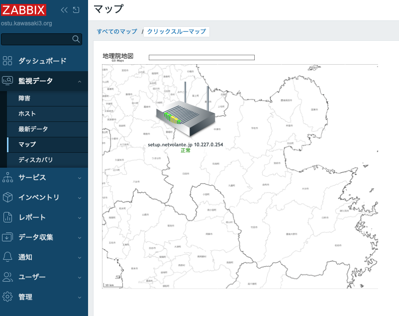
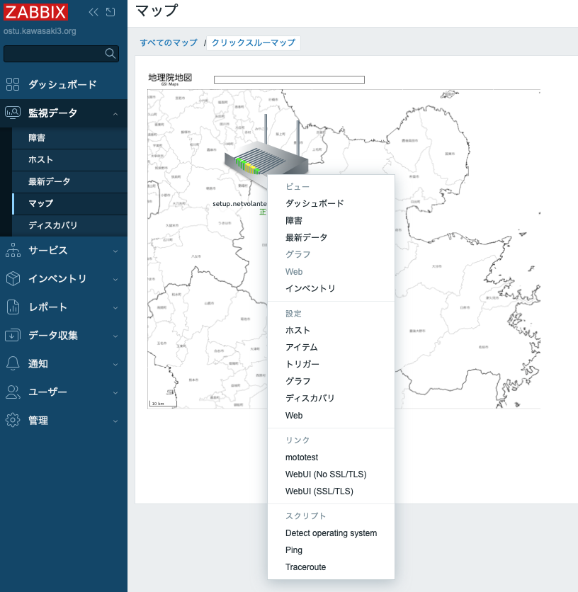
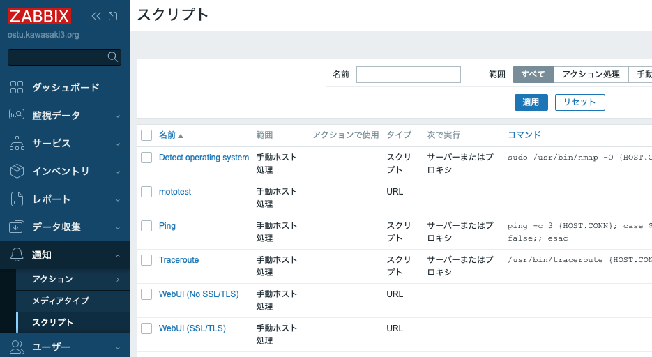

# Zabbix ネットワークマップにインタラクティブシェルを

## 今回のまとめ

- 使用環境
  - [Ubuntu 24.04 LTS Server](https://jp.ubuntu.com/download)
  - [Zabbix 7.0.28 LTS](https://www.zabbix.com/jp/whats_new_7_0)
  - [ttyd 1.7.4](https://github.com/tsl0922/ttyd)

- Zabbix には、ネットワークマップ機能がある。
  - Zabbix/監視データ/マップ/すべてのマップ で「マップの作成」。
  - 監視対象ノードをマップ上のアイコンとして貼り付けることができる。
  - このノードアイコンに警報発報状況を色などで表示することもできる。
  - マップの背景に画像を貼ることもできる。
  - ネットワークマップ上のノードアイコンをクリックすると、メニューがポップアップして
    様々な機能を呼び出すことができる。

- 今回は、このポップアップメニューから当該ノードのインタフェースに
  アクセスすることを実現した。
  - ポップアップメニューで使える「スクリプト」は、
    - 設定ファイルでデフォルトでは無効になっているのを有効に変更する必要がある。
    - Zabbix/通知/スクリプト で「スクリプトの作成」から作成できる。
  - 当該ノードに管理用の WebUI があるなら、URLタイプのスクリプトに
    URLを書いておくことでポップアップメニューからジャンプできる。
  - 当該ノードに telnet や ssh でログインできるなら、
    - SSHタイプやTelnetタイプのスクリプトを定義することで、SSH/Telnet でログイン
      してコマンドを実行した結果を表示させることができる。
    - しかし、これはターミナルからログインした時のインタラクティブシェルではないので、
      ちょっと不便かもしれない。
    - ttyd と組み合わせることで、ブラウザ上でインタラクティブシェルを使うことが
      できる構成にできる。

- 2026-07-15頃書いた。

## ネットワークマップ作成

- ネットワークマップの作成については、Zabbixのマニュアルの
  [ネットワークマップの設定](https://www.zabbix.com/documentation/7.0/jp/manual/config/visualization/maps/map)
  などを見てほしい。
- 基本的には、 「Zabbix/監視データ/マップ/すべてのマップ」で「マップの作成」を実行すれば良い。
- 作成したマップの例はこちら。
  - ひとつだけだが、監視対象ノードを追加してある。
  - 背景に大分県の白地図を入れてある。(地理院地図さま、ありがとうございます)

  作成したマップの例

## グローバルスクリプト無効化解除

- この版の Zabbix では、「グローバルスクリプト」はデフォルトでは無効状態になっている。
  - 設定ファイル /etc/zabbix/zabbix_server.conf で EnableGlobalScripts=0
    ```
    ### Option: EnableGlobalScripts
    #    Enable global scripts on Zabbix server.
    #       0 - disable
    #       1 - enable
    #
    # Mandatory: no
    # Default:
    # EnableGlobalScripts=1
    EnableGlobalScripts=0
    ```
- 有効にするには、
  - zabbix_server.conf を書き換えても良いし、
  - /etc/zabbix/zabbix_server.d/ にファイルを追加して設定を修正しても良い。
    ```
    # cat /etc/zabbix/zabbix_server.d/scripts.conf 
    EnableGlobalScripts=1
    ```
  - どちらの場合でも、zabbix プロセスの再起動 `systemctl restart zabbix` が必要。
  - これで、さっきのネットワークマップ上のノードアイコンをクリックすると、
    ポップアップメニューに「リンク」や「スクリプト」が出現する。
    - もともと Ping, Traceroute や Telnet, Ssh が入っている。
    - 下図は実験のためにいじった後なのでちょっといろいろ変わってしまっているが。

  ポップアップメニューの例

## スクリプトの作成

- ポップアップメニューに出現するスクリプトは、「Zabbix/通知/スクリプト」で管理されている。
  - 余談になるが、「それがここにあるの!?普通はこことは思わんやろー」という体験が割と多い気がする Zabbix 。

  スクリプトの管理画面


## URL タイプのスクリプト
## SSH/Telnet タイプのスクリプト
## ttyd と組み合わせてインタラクティブシェルを実現
