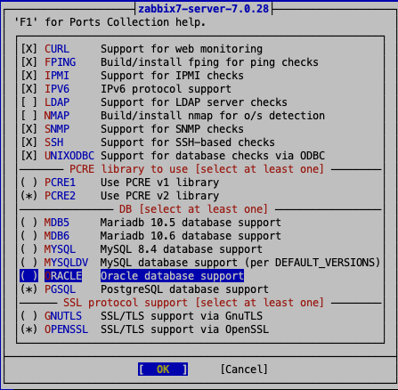
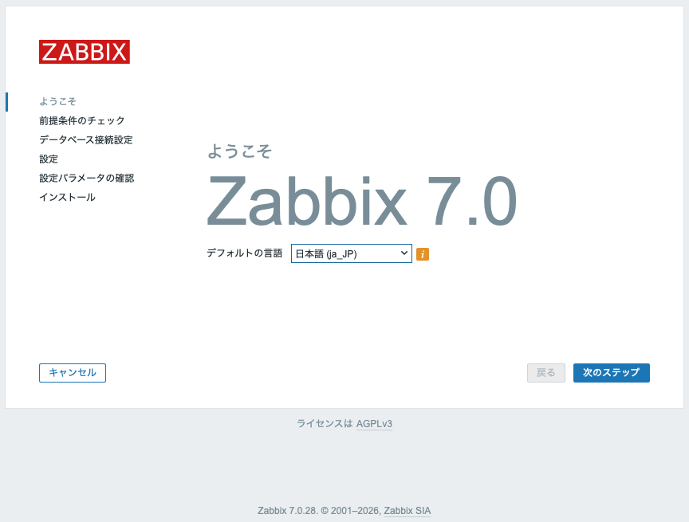
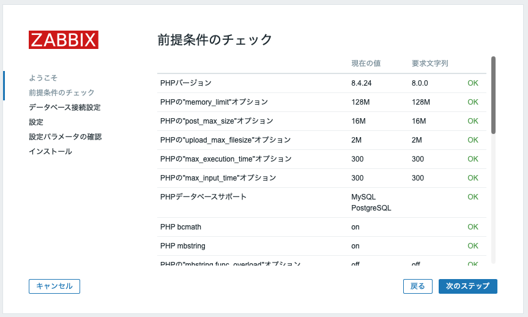
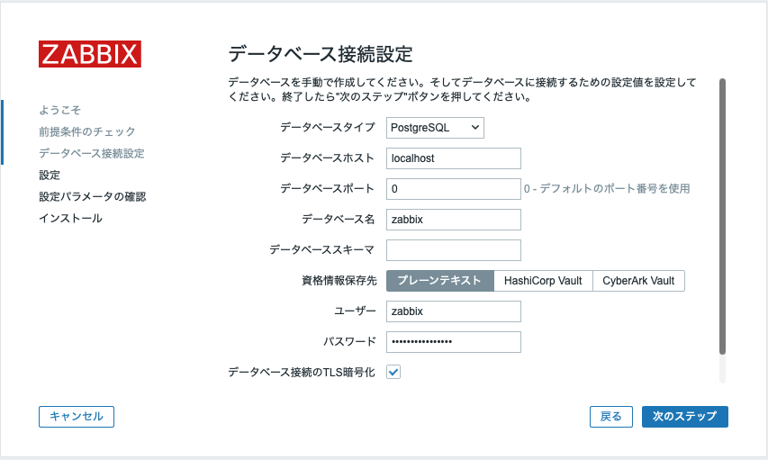
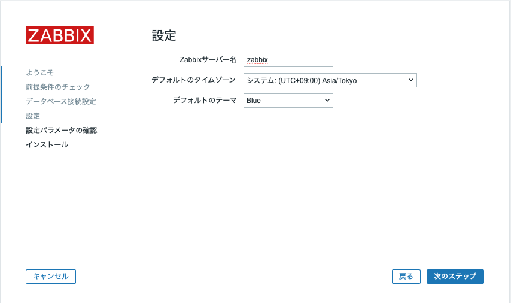
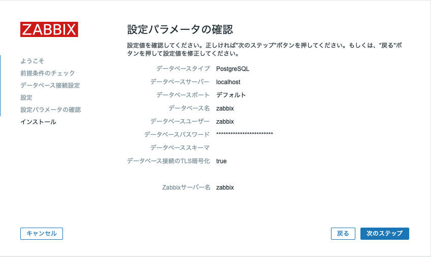
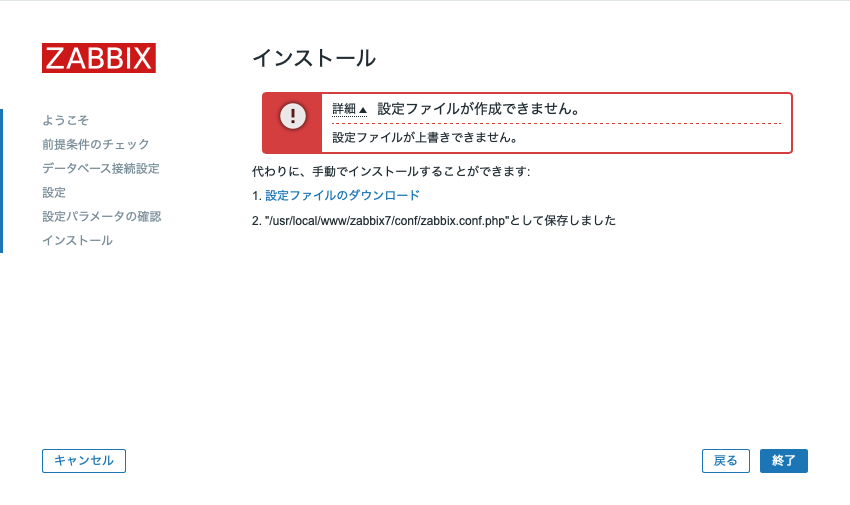
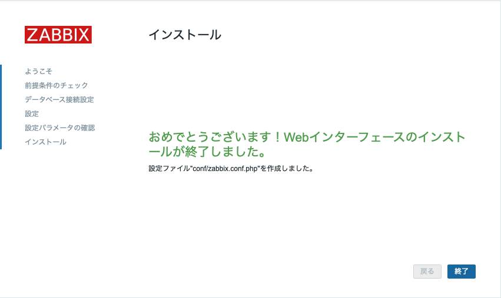
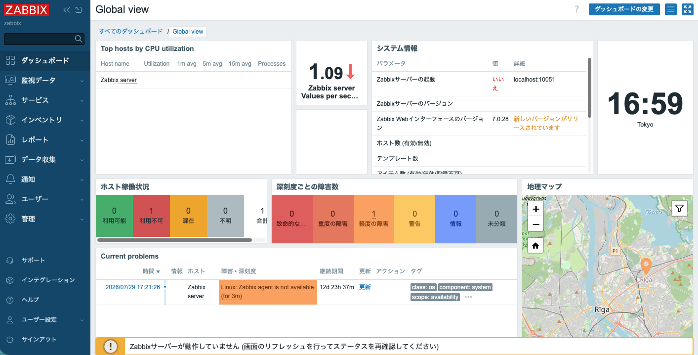

# Zabbix 7 LTS on FreeBSD

Ubuntu をはじめとする Linux 上に Zabbix をインストールするなら
[Download and install Zabbix](https://www.zabbix.com/jp/download?zabbix=7.0&os_distribution=ubuntu&os_version=24.04&components=server_frontend_agent&db=pgsql&ws=nginx)
のページの指示通りにやれば簡単にインストールできる。
僕の場合はたいてい Ubuntu にインストールしていて、
そういえば FreeBSD にインストールしたことがないかもしれない。
ということで Zabbix 7 LTS を FreeBSD にインストールする手順をメモしておく。
(2026-07-23)

## 使用したバージョン

- FreeBSD 15.1-RELEASE-p1
- Zabbix 7.0 LTS (7.0.28)
- PostgreSQL 18.4

## データベースの準備

どうやら Zabbix での DBMS の第一候補は MySQL/MariaDB であるようだが、
ここでは PostgreSQL で行く。
別に MariaDB でもいいんだけれど、自分が慣れているのが PostgreSQL だというだけのこと。

### PostgreSQL インストール

まず、FreeBSD/Ports で現在デフォルトのバージョンを調べる。
Ports 内のパッケージがそのパッケージに依存する時の「デフォルト」バージョンなので、
デフォルトバージョンのものをインストールしておくほうが楽だというだけ。

調べ方は、
[Ports/ DEFAULT_VERSIONS](https://wiki.freebsd.org/Ports/DEFAULT_VERSIONS)
にある通りで、
[Mk/bsd.default-versions.mk](https://cgit.freebsd.org/ports/tree/Mk/bsd.default-versions.mk)
から PGSQL を探せばよい。
あるいは、`/usr/ports/UPDATING` で PHP を探すと、デフォルトバージョンが変更された
履歴を見ることができるので、これで判別してもよい。
``` shell
# grep "The default version of PostgreSQL" UPDATING
  The default version of PostgreSQL has been switched from 17 to 18.
  The default version of PostgreSQL has been switched from 16 to 17.
  The default version of PostgreSQL has been switched from 15 to 16.
  The default version of PostgreSQL has been switched from 13 to 15.
  The default version of PostgreSQL has been switched from 12 to 13.
```

今現在は PostgreSQL 18 であったので、pkg でインストールしておく。

``` shell
# pkg install postgresql18-server
```

### PostgreSQL の初期設定

- [FreeBSD wiki: PostgreSQL](https://wiki.freebsd.org/PostgreSQL/Setup)
  を参考にして、まず PostgreSQL の初期設定を行う。

- `sysrc postgresql_enable="YES"`
  - 僕の場合は `vi /etc/rc.conf.local` から手で書いちゃうけれど、いずれにしても
    postgresql デーモンを動かす設定。

- `service postgresql initdb`
  - PostgreSQL としては `initdb` という単独のコマンドでデータベース領域
    (/var/db/postgres/) を初期化する。
  - service コマンドを使って上記のようにしても同じことができる。
    (/usr/local/etc/rc.d/postgresql を参照)
  - これで、/var/db/postgres/data18/ ディレクトリが作成されて、
    各種設定ファイルなどがここに置かれる。
  - 蛇足ながら、この initdb は、インストール時に一度だけ実行するものである。

- `service postgresql start`
  - とりあえず、postgresql デーモンを立ち上げて、動作確認 `service postgresql status`
  - `sockstat -46 -p 5432` で待受ポートの IP アドレスとポート番号を確認。
    - 127.0.0.1 と ::1 の 5432/tcp で待ち受けているはず。
    - UNIX ドメインソケットは /tmp/.s.PGSQL.5432

- OS ユーザの postgres にパスワードを付与。
  - `sudo passwd postgres`

- DB ユーザの postgres にもパスワードを付与。
  - ```
    $ sudo su - psql
    $ psql
    > ALTER ROLE posgres WITH ENCRYPTED PASSWORD 'superdupersecret';
    ```

- PostgreSQL へのログイン時の認証設定を変更
  - デフォルトでは、localhost からの接続は trust されていて認証無しで DB ログイン可能。
  - どこからアクセスしても、パスワード認証を要求するように変更する。
  - `vi /var/db/postgres/data18/pg_hba.conf`
    ``` diff
    # diff -u pg_hba.conf.orig pg_hba.conf
    --- pg_hba.conf.orig	2026-07-23 16:15:09.734234000 +0900
    +++ pg_hba.conf	2026-07-22 16:53:39.538404000 +0900
    @@ -114,13 +114,13 @@
     # TYPE  DATABASE        USER            ADDRESS                 METHOD

     # "local" is for Unix domain socket connections only
    -local   all             all                                     trust
    +local   all             all                                     scram-sha-256
     # IPv4 local connections:
    -host    all             all             127.0.0.1/32            trust
    +host    all             all             127.0.0.1/32            scram-sha-256
     # IPv6 local connections:
    -host    all             all             ::1/128                 trust
    +host    all             all             ::1/128                 scram-sha-256
     # Allow replication connections from localhost, by a user with the
     # replication privilege.
    -local   replication     all                                     trust
    -host    replication     all             127.0.0.1/32            trust
    -host    replication     all             ::1/128                 trust
    +local   replication     all                                     scram-sha-256
    +host    replication     all             127.0.0.1/32            scram-sha-256
    +host    replication     all             ::1/128                 scram-sha-256
    ```
  - `service postgresql restart` で設定変更を適用。

- .pgpass ファイルの設定
  - PostgreSQL では、OS ユーザの ~/.pgpass を設定しておくことで、psql でのパスワード入力を自動化できる。
    ```
    # ~/.pgpass
    # hostname:port:database:username:password
    *:*:*:postgres:superdupersecret
    ```
  - psql に与える DB ユーザ名は、
    - デフォルトでは OS ユーザ名を使う
    - 環境変数 PGUSER に設定しておけばその DB ユーザ名を使ってくれる。
    - `psql -U postgres` のようにコマンドラインオプションで指定することもできる。

- これで、PostgreSQL のインストールは一旦完了。

## Zabbix サーバの準備

### Zabbix サーバのインストール

- Ports の zabbix7-server パッケージは、MySQL/MariaDB 用にコンパイルされているので、
  PostgreSQL で使いたい場合には /usr/ports/net-mgmt/zabbix7-server でコンパイルする
  必要がある。

  - /usr/ports に Ports コレクションを展開するためには、git clone する。
    ``` shell
    # git clone https://git.FreeBSD.org/ports.git /usr/ports
    # git -C /usr/ports pull
    ```
  - 詳しくは、
    [4.5.1 Ports Collection のインストール](https://docs.freebsd.org/ja/books/handbook/ports/#ports-using-installation-methods)
    を参照のこと。
  - zabbixをコンパイルするには、
    ``` shell
    # cd /usr/ports/net-mgmt/zabbix7-server
    # make config
    # make
    # make install
    ```
  - `make config` のところで、MYSQLDVの選択を外し、PGSQLを選択する。
    これで PostgreSQL 対応になる。
     - make config画面

### Zabbix サーバの初期設定

- 設定ファイルは `/usr/local/etc/zabbix7/zabbix_server.conf` 。
- この設定ファイルの末尾にある `Include` 文を有効にして、
  `/usr/local/etc/zabbix7/zabbix_server.conf.d/*.conf` に合致する
  ファイルを読み込むようにする。(まぁ、この辺のやり方はお好みですが)
  ``` diff
  # cd /usr/local/etc/zabbix7
  # diff -u zabbix_server.conf.sample zabbix_server.conf
  --- zabbix_server.conf.sample	2026-08-03 16:55:30.602510000 +0900
  +++ zabbix_server.conf	2026-08-03 16:56:46.490440000 +0900
  @@ -1124,4 +1124,4 @@

   # Include=/usr/local/etc/zabbix7/zabbix_server.general.conf
   # Include=/usr/local/etc/zabbix7/zabbix_server.conf.d/
  -# Include=/usr/local/etc/zabbix7/zabbix_server.conf.d/*.conf
  +Include=/usr/local/etc/zabbix7/zabbix_server.conf.d/*.conf
  ```
- `/usr/local/etc/zabbix7/zabbix_server.conf.d/` の下に設定ファイルを追加。
  ``` shell
  # ls -l ./zabbix_server.conf.d
  total 16
  -r--------  1 root wheel  98 Aug  3 16:58 dbpasswd.conf
  -rw-r--r--  1 root wheel 112 Aug  3 17:00 local.conf

  # cat ./zabbix_server.conf.d/dbpasswd.conf 
  DBPassword=superdupersecret

  # cat ./zabbix_server.conf.d/local.conf
  LogFileSize=10
  DBHost=
  DBSocket=/tmp/.s.PGSQL.5432
  ```
- `dbpasswd.conf` には、DBユーザ zabbix のパスワード(だけ)を書く。
  一般ユーザその他に読まれても困るので、パーミッションを狭めてある点に注意。
- `local.conf` には、その他の設定を書く。
  ここではログローテーションの際のトリガーになるファイルサイズ(`LogFileSize`)と
  PostgreSQLサーバに接続に行く設定(UNIXドメインのソケット)を書いた。
- ここまでできたら、`/etc/rc.conf` で `zabbix_server` を起動する設定を入れて、
  起動する。
  ``` shell
  # sysrc zabbix_server_enable="YES"
  # service zabbix_server start
  ```
- 正しく起動できたかどうかを、ログファイルで確認すること。
  - ログファイルは `/var/log/zabbix/zabbix_server.log`
  - 数分間待ってもエラー/警告が出ないこと。

## Zabbix Front-end の準備

### zabbix7-frontend-php84 をインストール

- 例によって、PHP のデフォルトバージョンを探すと、今現在は PHP 8.4 が
  デフォルトバージョンであることがわかった。
- ということは、インストールすべきは `zabbix7-frontend-php84` である。
  ``` shell
  # pkg search zabbix7-frontend
  zabbix7-frontend-php82-7.0.28  Enterprise-class open source distributed monitoring (frontend-php82)
  zabbix7-frontend-php83-7.0.28  Enterprise-class open source distributed monitoring (frontend-php83)
  zabbix7-frontend-php84-7.0.28  Enterprise-class open source distributed monitoring (frontend-php84)
  zabbix7-frontend-php85-7.0.28  Enterprise-class open source distributed monitoring (frontend-php85)
  zabbix7-frontend-php86-7.0.28  Enterprise-class open source distributed monitoring (frontend-php86)
  ```

- インストールすると、`/usr/local/www/zabbix7` にコンテンツが置かれる。
  ``` shell
  # pkg install zabbix7-frontend-php84 php84-curl php84-pgsql php84-pdo_pgsql
  # cd /usr/local/www/zabbix7
  # ls
  api_jsonrpc.php              graphs.php                   jsrpc.php
  api_scim.php                 history.php                  local/
  app/                         host_discovery.php           locale/
  assets/                      host_prototypes.php          map.php
  audio/                       hostinventories.php          modules/
  browserwarning.php           hostinventoriesoverview.php  report2.php
  chart.php                    httpconf.php                 report4.php
  chart2.php                   httpdetails.php              robots.txt
  chart3.php                   image.php                    setup.php
  chart4.php                   imgstore.php                 sysmap.php
  chart6.php                   include/                     sysmaps.php
  chart7.php                   index.php                    tr_events.php
  composer.json                index_http.php               vendor/
  composer.lock                index_mfa.php                widgets/
  conf/                        index_sso.php                zabbix.php
  data/                        js/
  favicon.ico                  jsLoader.php
  ```
  - Zabbix WebUI の「前提条件のチェック」で警告が出るので php84-curl もインストールしてある。
  - Zabbix WebUI の「データベース接続設定」で MySQL だけでなく PostgreSQL も選択できるように、
    php84-pgsql と php84-pdo_pgsql もインストールしてある。

### PHP-fpm の設定

- `zabbix7-frontend-php84` をインストールすると、必要な PHP や php-fpm もインストールされるので、
  まずは、PHPとしての設定をしておく。
  - 設定ファイル群は /usr/local/etc の下。

- php.ini の調整
  - php.ini-production をコピーして php.ini とする。
  ``` shell
  # cd /usr/local/etc

  # ls -l php.ini*
  -rw-r--r--  1 root wheel 68914 Aug  8 10:20 php.ini-development
  -rw-r--r--  1 root wheel 69048 Aug  8 10:20 php.ini-production

  # cp -i php.ini-production php.ini
  ```
  - php.ini でデフォルトのタイムゾーン等を設定する。
    これは Zabbix WebUI 動作後の初期設定でチェックされる諸点である。
  ``` diff
  --- php.ini-production	2026-08-08 10:20:32.000000000 +0900
  +++ php.ini	2026-08-11 14:16:17.279542000 +0900
  @@ -406,7 +406,7 @@
   ; Maximum execution time of each script, in seconds
   ; https://php.net/max-execution-time
   ; Note: This directive is hardcoded to 0 for the CLI SAPI
  -max_execution_time = 30
  +max_execution_time = 300

   ; Maximum amount of time each script may spend parsing request data. It's a good
   ; idea to limit this time on productions servers in order to eliminate unexpectedly
  @@ -416,7 +416,7 @@
   ; Development Value: 60 (60 seconds)
   ; Production Value: 60 (60 seconds)
   ; https://php.net/max-input-time
  -max_input_time = 60
  +max_input_time = 300

   ; Maximum input variable nesting level
   ; https://php.net/max-input-nesting-level
  @@ -696,7 +696,7 @@
   ; Its value may be 0 to disable the limit. It is ignored if POST data reading
   ; is disabled through enable_post_data_reading.
   ; https://php.net/post-max-size
  -post_max_size = 8M
  +post_max_size = 16M

   ; Automatically add files before PHP document.
   ; https://php.net/auto-prepend-file
  @@ -963,7 +963,7 @@
   [Date]
   ; Defines the default timezone used by the date functions
   ; https://php.net/date.timezone
  -;date.timezone =
  +date.timezone = Asia/Tokyo

   ; https://php.net/date.default-latitude
   ;date.default_latitude = 31.7667
  ```

- php-fpm.conf の調整は、この時点ではやることがない。
  - 下の設定ファイルを眺めておくと良いかもしれない。
    このうちの、php-fpm.conf と www.conf が設定ファイルとして使われるもので、
    bind()先は www.conf の方に `listen = 127.0.0.1:9000` と定義されている。
  ``` shell
  # pwd
  /usr/local/etc
  root@ost:etc# ls -l php-fpm*
  -rw-r--r--  1 root wheel 5305 Aug  8 10:20 php-fpm.conf
  -rw-r--r--  1 root wheel 5305 Aug  8 10:20 php-fpm.conf.default

  php-fpm.d:
  total 96
  -rw-r--r--  1 root wheel 22394 Aug  8 10:20 www.conf
  -rw-r--r--  1 root wheel 22394 Aug  8 10:20 www.conf.default
  ```

- php-fpm の起動
  - /etc/rc.conf に `php_fpm_enable="YES"` を追記して、daemon を起動する。
  ``` shell
  # sysrc php_fpm_enable="YES"

  # service php_fpm status
  php_fpm is not running.

  # service php_fpm start
  Performing sanity check on php-fpm configuration:
  [11-Aug-2026 10:16:56] NOTICE: configuration file /usr/local/etc/php-fpm.conf test is successful
  Starting php_fpm.

  # service php_fpm status
  php_fpm is running as pid 98766.

  # sockstat -46 -p9000
  USER COMMAND      PID FD PROTO LOCAL ADDRESS         FOREIGN ADDRESS
  www  php-fpm    99993  5 tcp4  127.0.0.1:9000        *:*
  www  php-fpm    99392  5 tcp4  127.0.0.1:9000        *:*
  root php-fpm    98766  7 tcp4  127.0.0.1:9000        *:*
  ```

### nginx.conf の設定

- Zabbix 用の server を追加して、それを php-fpm の待受ポートに繋ぐ設定。
  追加した nginx.conf 的 server は次の通り。
  ```
  server {
        listen 443 ssl;
        server_name zabbix;

        root /usr/local/www/zabbix7;
        index index.php index.html index.htm;

        access_log /var/log/nginx/zabbix_access.log;
        error_log  /var/log/nginx/zabbix_error.log;

        ssl_certificate      /etc/ssl/ost/ost.crt;
        ssl_certificate_key  /etc/ssl/ost/ost.key;

        ssl_session_cache    shared:SSL:1m;
        ssl_session_timeout  5m;

        ssl_ciphers  HIGH:!aNULL:!MD5;
        ssl_prefer_server_ciphers  on;

        location / {
            try_files $uri $uri/ /index.php?$args;
        }

        location ~ \.php$ { 
            fastcgi_pass    127.0.0.1:9000;
            fastcgi_index   index.php;
            fastcgi_param   SCRIPT_FILENAME $document_root$fastcgi_script_name;
            include         fastcgi_params;
        }

        location ~ /\.ht {
            deny all;
        }
    }
   ```

## Zabbix WebUI 初期設定

- これでブラウザから https://zabbix/ へアクセスすると、Zabbix WebUI の画面が出る(はず)。
  画面に従って、Zabbix WebUI の初期設定を進める。

- まずは、「デフォルトの言語」を「日本語(ja_JP)」に変更。

  Zabbix WebUI 初期画面

- 「前提条件のチェック」で、すべて OK になるまで調整する。

  Zabbix WebUI 前提条件のチェック

- 「データベース接続設定」で「パスワード」を入力。

  Zabbix WebUI データベース接続設定

- 「設定」で「Zabbix サーバ名」を入力。

  Zabbix WebUI 設定

- 「設定パラメータの確認」で投入したパラメータが正しいことを確認する。

  Zabbix WebUI 設定パラメータの確認

- 「インストール」で、初期設定内容を /usr/local/www/zabbix7/config/zabbix.conf.php に
  書き込もうとするが、権限の関係で失敗する。

  Zabbix WebUI インストール(失敗)

  - WebUI のプロセスは nginx なので www ユーザ。
  - 初期設定内容を書き込むためには、このユーザから zabbix.conf.php に対して書き込めて
    パーミッション変更ができなければならない。
  - また、書き込み後の起動時に設定を読めなければならないので、www ユーザから読める必要もある。
  - さらに、データベース接続のクレデンシャルズを平文で含むので、その他の一般ユーザから読めては
    困る。
  - そこで、一時的に権限を変更して (再)作成した後、必要な権限状態に変更する。
  ``` shell
  # cd /usr/local/www/zabbix7/conf
  # ls -ld
  drwxr-xr-x  3 root wheel 512 Aug 11 14:37 ./

  # chmod 777 .
  ```

  - ここで Zabbix WebUI から書き込ませると今度は成功する。

  Zabbix WebUI インストール(成功)

  - zabbix.conf.php が作成されていることを確認。(<== のところ)
    Zabbix WebUI からは変更できないように権限を修正しておく。
  ``` shell
  # ls -l
  total 40
  -rw-r--r--  1 root wheel  163 Jul  6 22:34 .htaccess
  drwxr-xr-x  2 root wheel  512 Aug  3 17:41 certs/
  -rw-r--r--  1 root wheel  946 Jul  6 22:34 maintenance.inc.php
  -rw-------  1 www  wheel 1758 Aug 11 15:33 zabbix.conf.php         <==
  -rw-r--r--  1 root wheel 1722 Jul  7 01:15 zabbix.conf.php.example
  # chmod 755 .
  # chown root:www zabbix.conf.php
  # chmod 640 zabbix.conf.php
  ```

- Zabbix WebUI 初期設定の php ファイルは /usr/local/www/zabbix7/setup.php だが、
  もう使うことはないので、削除するなり `$documentroot` 外へ逃がすなり nginx.conf で
  アクセス制御するなりして、無効化しておいたほうが良いかもしれない。
  - nginx.confでアクセス制御する例。`\.php` を zabbix デーモンへ送るより *前に*
    setup.php を禁止している点に注意。
  ``` diff
  --- nginx.conf	2026-08-11 16:54:16.336801000 +0900
  +++ nginx.conf.nosetup	2026-08-11 16:54:00.563905000 +0900
  @@ -140,6 +140,10 @@
	       try_files $uri $uri/ /index.php?$args;
	   }

  +        location ~ /setup.php$ {
  +            deny all;
  +        }
  +
	   location ~ \.php$ {
	       fastcgi_pass    127.0.0.1:9000;
	       fastcgi_index   index.php;
  ```


## Zabbix サーバの更新ミス

- これで Zabbix WebUI からの初期設定が終わったので、初回ログインを行う。
  - 初期パスワードは Admin / zabbix 。
- すると、「Zabbixサーバーが動作していません (画面のリフレッシュを行ってステータスを
  再確認して下さい)」というエラー表示が出た。
  (下図の最下部)

  Zabbixサーバが動作していません

- これは、Zabbix WebUI 側から Zabbix サーバ (`127.0.0.1:10051`) に接続できなかった時の
  メッセージであるとのこと。
  - 参考：[Zabbixサーバーが動作していませんという表示が出る](https://www.zabbix.jp/node/5640)
  - 参考：[「Zabbixサーバーが動作していません」と、なった時の対処法](https://zenn.dev/tttkccc/articles/zabbix-article)
  - 典型的には、
    - /usr/local/www/zabbix7/conf/zabbix.conf.php の `$ZBX_SERVER` や
      `$ZBX_SERVER_PORT` のあたりの問題で、特に `$ZBX_SERVER = 'localhost'` である場合に
      localhost が ::1 に解決されちゃうけれど、サーバ側が待ち受けているのは 127.0.0.1 みたいな
      齟齬があるとこの現象が起きるらしい。
    - /usr/local/etc/zabbix7/zabbix_server.conf の `DBPassword` が設定されていない等で、
      Zabbix サーバからデータベースへの接続ができていない (ので Zabbix サーバが立ち上がれず、
      その結果として localhost:10051 で待ち受けていない) と、この現象が起きる場合もあるらしい。
  - Zabbix サーバのログを見ると、MySQL に接続を試行するも接続できない状態であることがわかった。
    ```
    # tail -3 zabbix_server.log
     32045:20260722:083453.587 database is down: reconnecting in 10 seconds
     32045:20260722:083503.589 [Z3001] connection to database 'zabbix' failed: [2002] Can't connect to local MySQL server through socket '/tmp/mysql.sock' (2)
     32045:20260722:083503.589 database is down: reconnecting in 10 seconds
    ```
  - これはどこかで見たぞ、ということで、
    [zabbix-サーバのインストール](zabbix-サーバのインストール)
    を思い出すと、
    - 今回は PostgreSQL を使いたかったので、
    - Ports/pkg のバイナリインストールの zabbix7-server ではダメで、
    - Ports のツリーを clone してコンパイルオプションを変更したうえでコンパイルしたのだった。
    - そして、この現象が出る直前に、手癖で `pkg upgrade` していたのだった。
    - その時に、zabbix7-server パッケージのバージョンが上がっていて、それをバイナリインストール
      していたのであった。
    - というわけで、再コンパイルして再インストールして解決した。

## Zabbix agent のインストール

- 気を取り直して、Zabbix WebUI への初回ログインを行う。


- そういうわけで、Zabbix Agent をインストールして動作させる。

- まず、 `zabbix7Ports からインストールする。
  ``` shell
  # pkg install zabbix7-agent
  ```


