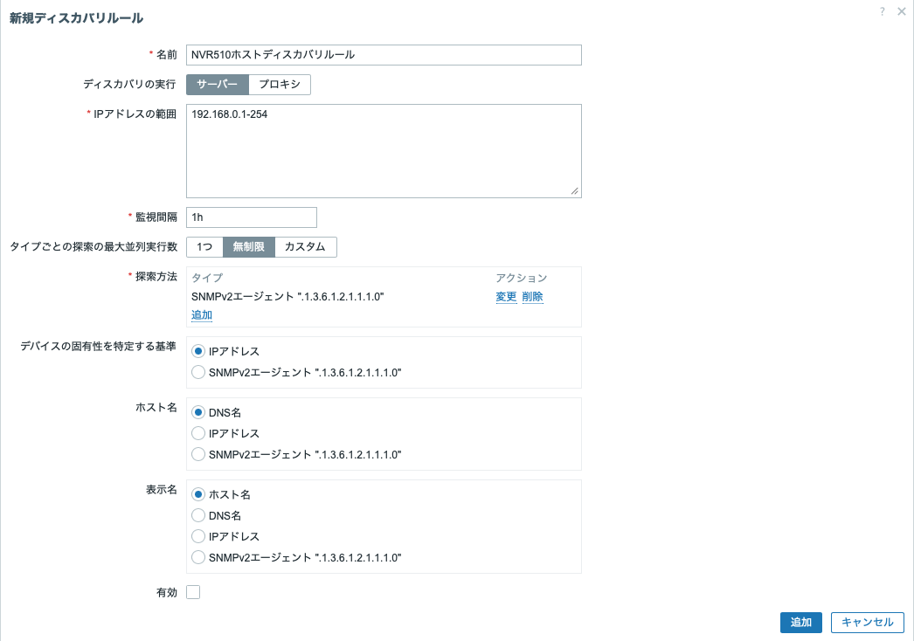
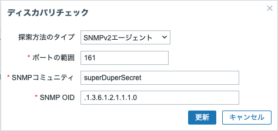
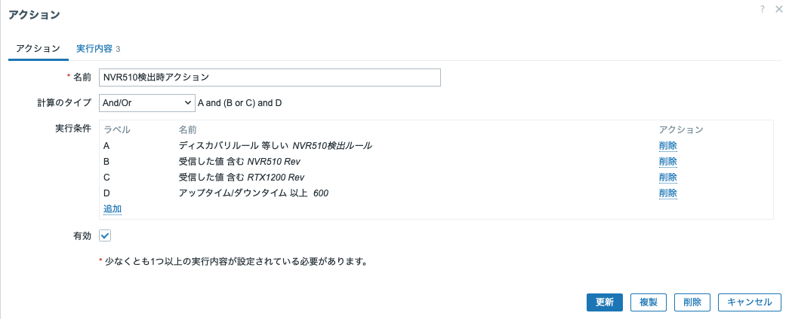
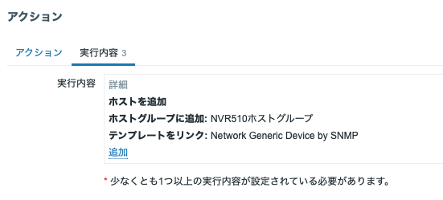

# Zabbix7でSNMPディスカバリ

## あらすじ

ひょんなことから、Zabbix7 を建てて SNMP によるデータ収集をすることになった。
それなりにハマったので、覚書を残しておきたい。

## 環境

- [倍控社の迷你工控机](https://bkhdpc.com/jisuanji/)の古いやつで、
  G30B-N5105だと思われる筐体。
  - ここに Ubuntu を入れて Zabbix サーバにする。
  - いわゆるミニPCで、ファンレス。
  - Celeron N5105 / 16GB メモリ / 128GB SSD / 2.5Gbps LAN * 4
  - 2.5Gbps のルータにしようと思ったら Intel I226-V で、通信ブツ切れ
    でどうにもならないやつだった。Ubuntuだとちょっとマシみたい。
    - [Ubuntu 24.04 LTS Server](https://jp.ubuntu.com/download)
    - 24.04.4 LTS (Noble Numbat)
    - apt upgrade済み
    - [PostgreSQL 16.13](https://www.postgresql.org/about/news/postgresql-183-179-1613-1517-and-1422-released-3246/)
    - apt でパッケージをインストール
    - [TimescaleDB 2.25.2](https://www.tigerdata.com/docs/self-hosted/latest/install/installation-linux#install-timescale_db-on-linux)
    - TimescaleDBのリポジトリを追加して、そこからパッケージをインストール。
    - [Zabbix 7.0 LTS](https://www.zabbix.com/download?zabbix=7.0&os_distribution=ubuntu&os_version=24.04&components=server_frontend_agent_2&db=pgsql&ws=nginx)
    - 7.0 LTS / Ubuntu / 24.04 (Noble) / Server, Frontend, Agent2 / PostgreSQL / Nginx
    - パッケージをダウンロードして dpkg -i でインストール。
- [NVR510](https://network.yamaha.com/products/routers/nvr510/index)
  - これをZabbixからSNMPで監視したい。
  - [NVR510 SNMP MIBリファレンス](https://www.rtpro.yamaha.co.jp/RT/docs/snmp/snmp_mib_nvr510.html)
- [NetSNMP](https://www.net-snmp.org)と各種MIB定義ファイル
  - snmp-mibs-downloaderパッケージも併せてaptでインストール。
  - NVR510用のMIB定義ファイルももらってきて、これは手動でインストール。
    - [YAMAHA private MIB](https://www.rtpro.yamaha.co.jp/RT/docs/mib/)
      の
      [Archive file of all private MIB files.](https://www.rtpro.yamaha.co.jp/RT/docs/mib/yamaha-private-mib.tar.gz)
      を入れたので、YAMAHAのネットワーク機器なら大体大丈夫のはず。
- snmptranslateやsnmpwalkなどを用いてNVR510と通信できるように
  両側で設定しておく。

## ホストディスカバリ

- Zabbix から SNMP で RFC1213-MIB::sysDescr.0 を取ってきて、それが
  NVR510 のものだったら監視対象に追加する、という論理。
  - ICMP echoに応答があれば追加とかもできるけど、それだと他のノードも
    追加してしまうので、一応機種まで見ることにした。
  - 今回は SNMPv2 でコミュニティ(RO)を設定してあるので、例え NVR510 で
    あっても別のコミュニティのノードは検出しない。

- コマンドラインからはこんな感じで応答が返ってくる。
  ``` shell
  $ cat ~/.snmp/snmp.conf
  defVersion 2c
  defCommunity superDuperSecret
  $ snmpget 10.227.0.254 .1.3.6.1.2.1.1.1.0
  RFC1213-MIB::sysDescr.0 = STRING: "NVR510 Rev.15.01.26 (Fri Aug 23 10:36:30 2024)"
  ```

### SNMP でスキャンさせる

まず、Zabbix から SNMP でスキャンしてホストを探すように設定する。

- そのためには、「Zabbix/データ収集/ディスカバリ」でディスカバリルール
  を追加する。
  これによって、指定したIPアドレス群に対して指定した方法でホストディス
  カバリのためのスキャンを行う。
  - 名前: 適宜、名前を付ける。
  - ディスカバリの実行: 今回はプロクシZabbixノードを使っていないので、
    「サーバ」を選択。
  - IPアドレスの範囲: 指定されたIPアドレス(の範囲)について、ホストディ
    スカバリを行う。今回はNVR510のアドレス１個だけに限定。
    - 複数の範囲があるときはカンマで区切って並べる。
    - 192.168.0.100 等と書けば /32 指定であるらしい。
    - 192.168.0.0/24 などとも書ける。
    - 192.168.0.1-3 と書けば、192.168.0.1 から 192.168.0.3 までの 3 IP。
    - 192.168.5-6.254 と書けば、192.168.5.254 と 192.168.6.254 らしい。
      (本当？
  - 監視間隔: 運用時はデフォルトの 1h でいいと思うけど、検証中は 5m く
    らいでよいのではないか。
  - タイプごとの探索の最大並列実行数: デフォルトでは無制限だが、カスタ
    ムで 16 くらいが良いのではないか。監視間隔との兼ね合いもある。
  - 探索方法: 「追加」をクリックすると「ディスカバリチェック」の画面が
    ポップアップするので、適切な探索方法を構成する。
    - 今回は、「SNMPv2 エージェント」で
    - ポートはデフォルトの 161 、
    - SNMPコミュニティは NVR510 と通信できるもの(上記のコマンドライン
      を参照)、
    - SNMP OID は上記の sysDescr.0 の OID を指定。
  - デバイスの固有性を特定する基準: IPアドレスを指定。
    - 上で指定した SNMP OID だと機種が返されるので、固有性を特定できな
      い。
  - ホスト名: 今回はIPアドレスにしたが、デフォルトのDNS名でもよさそう。
  - 表示名: 今回はIPアドレスにしたが、デフォルトのホスト名で良さそう。
  - 有効: 有効にしておけばホストディスカバリを開始する。

  ディスカバリルール
  ディスカバリチェック

### スキャンへの応答を調べて、条件に合えば登録作業を行う

次に、スキャンへの応答を調べて、条件に合うかどうかを調べ、合えば監視
対象としてホストを登録する。

- そのためには、「Zabbix/通知/アクション/ディスカバリアクション」で
  アクションを作成する。
  アクションは、「アクション」と「実行内容」の２個のタブに分かれている
  (ややこしい)。
- まず「アクション」タブ。
  - 名前: 適宜、名前を付ける。
  - 計算のタイプ: この後の「実行条件」をANDで結ぶのか、ORで結ぶのか、
    同一条件部分だけORで結んで異なる条件同士はANDで結ぶのか。
    ここでは、「And/Or」の例を作ってある。
  - 実行条件 A: 先ほど作成した「(ホスト)ディスカバリルール」を指定する。
    そのルールでスキャンに応答してきたものをこれ以降の条件に合うかどう
    か調べよということ。
  - 実行条件 B: 「受信した値」が "NVR510" を含むという条件。今探している
    NVR510なら含むし、別の機種なら多分含まないであろう。
  - 実行条件 C: 受信した値が "RTX1300" を含むという条件。実行条件 B と
    同じ「受信した値」の条件なので、「計算のタイプ」が「And/Or」であれ
    ば「実行条件B」と「実行条件C」はORで結ばれる。
  - 実行条件 D: 「アップタイム/ダウンタイム」が 600 秒以上であるという
    条件。ある程度の時間に渡って安定して存在/不在のときに登録/解除をや
    るということ。
  - 有効: 有効にしておく。
  - これで、`A and ( B or C ) and D` という論理式で真になれば、そのノー
    ドに対して後述の「実行内容」タブの内容を実行することになる。
- 続いて「実行内容」タブ
  - 「アクション」タブに設定した条件をクリアしたターゲットに対して、実
    行したいことを設定する。
  - まず「ホストを追加」で、監視対象として登録し、
  - 「ホストグループに追加」で「特定ルータホストグループ」(←あらかじ
    め作成済み)に追加し、
  - 「テンプレートをリンク」で、「特定ルータ監視用テンプレート by SNMP」
    (←後で作成する)にリンクする。このテンプレートには NVR510 に対する
    監視項目(の雛形)が設定してある。
- これでホストディスカバリは完了し、条件にあったノードをZabbix監視対象
  として登録するなどの作業を実施したことになる。

  アクション/アクションタブ
  アクション/実行内容タブ

## テンプレート作成

前節ホストディスカバリで、条件に合うノードを監視対象として登録し、
テンプレートを適用するところまではできた。
この節では、そのテンプレートを作成する。

- テンプレートは、「Zabbix/データ収集/テンプレート」で「テンプレートの
  作成」をクリックして作成する。
- 


