# Zabbix7でSNMPディスカバリ

## あらすじ

ひょんなことから、Zabbix7 を建てて SNMP によるデータ収集をすることになった。
それなりにハマったので、覚書を残しておきたい。

## 環境

- [倍控社の迷你工控机](https://bkhdpc.com/jisuanji/)の古いやつで、
  G30B-N5105だと思われる筐体。
  - ここに Ubuntu を入れて Zabbix サーバにする。
  - いわゆるミニPCで、ファンレス。
  - Celeron N5105 / 16GB メモリ / 128GB SSD / 2.5Gbps LAN * 4
  - 2.5Gbps のルータにしようと思ったら Intel I226-V で、通信ブツ切れ
    でどうにもならないやつだった。Ubuntuだとちょっとマシみたい。
  - [Ubuntu 24.04 LTS Server](https://jp.ubuntu.com/download)
    - 24.04.4 LTS (Noble Numbat)
    - apt upgrade済み
  - [PostgreSQL 16.13](https://www.postgresql.org/about/news/postgresql-183-179-1613-1517-and-1422-released-3246/)
    - apt でパッケージをインストール
  - [TimescaleDB 2.25.2](https://www.tigerdata.com/docs/self-hosted/latest/install/installation-linux#install-timescale_db-on-linux)
    - TimescaleDBのリポジトリを追加して、そこからパッケージをインストール。
  - [Zabbix 7.0 LTS](https://www.zabbix.com/download?zabbix=7.0&os_distribution=ubuntu&os_version=24.04&components=server_frontend_agent_2&db=pgsql&ws=nginx)
    - 7.0 LTS / Ubuntu / 24.04 (Noble) / Server, Frontend, Agent2 / PostgreSQL / Nginx
    - パッケージをダウンロードして dpkg -i でインストール。
- [NVR510](https://network.yamaha.com/products/routers/nvr510/index)
  - これを監視したい、Zabbixから、SNMPで。
  - [NVR510 SNMP MIBリファレンス](https://www.rtpro.yamaha.co.jp/RT/docs/snmp/snmp_mib_nvr510.html)
- [RTX1300](https://network.yamaha.com/products/routers/rtx1300/index)
  - これも監視したい、Zabbixから、SNMPで。
  - [RTX1300 SNMP MIBリファレンス](https://www.rtpro.yamaha.co.jp/RT/docs/snmp/snmp_mib_rtx1300.html)
- [NetSNMP](https://www.net-snmp.org)と各種MIB定義ファイル
  - snmp-mibs-downloaderパッケージも併せてaptでインストール。
  - YAMAHAのMIB定義ファイルももらってきて、これは手動でインストール。
    - [YAMAHA private MIB](https://www.rtpro.yamaha.co.jp/RT/docs/mib/)
      の
      [Archive file of all private MIB files.](https://www.rtpro.yamaha.co.jp/RT/docs/mib/yamaha-private-mib.tar.gz)
      を入れたので、YAMAHAのネットワーク機器なら大体大丈夫のはず。
- snmptranslateやsnmpwalkなどを用いてNVR510/RTX1300と通信できるように
  両側で設定しておく。
  - NVR510/RTX1300側は、SNMPv2でReadOnlyのコミュニティを設定。
  - Zabbixサーバ側は
    - プライベートMIBを/usr/share/snmp/の下に置いて
      ``` shell
      $ ls /usr/share/snmp
      mib2c-data/                    mib2c.iterate.conf
      mib2c.access_functions.conf    mib2c.mfd.conf
      mib2c.array-user.conf          mib2c.notify.conf
      mib2c.check_values_local.conf  mib2c.old-api.conf
      mib2c.check_values.conf        mib2c.perl.conf
      mib2c.column_defines.conf      mib2c.raw-table.conf
      mib2c.column_enums.conf        mib2c.scalar.conf
      mib2c.column_storage.conf      mib2c.table_data.conf
      mib2c.conf                     mibs/
      mib2c.container.conf           SensorDat.xml
      mib2c.create-dataset.conf      snmp_perl_trapd.pl
      mib2c.genhtml.conf             snmpconf-data/
      mib2c.int_watch.conf           yamaha-private-mib/
      mib2c.iterate_access.conf
      $ ls /usr/share/snmp/yamaha-private-mib/
      yamaha-product.mib.txt            yamaha-sw-firmware.mib.txt
      yamaha-rt-firmware.mib.txt        yamaha-sw-hardware.mib.txt
      yamaha-rt-hardware.mib.txt        yamaha-sw-l2ms.mib.txt
      yamaha-rt-interfaces.mib.txt      yamaha-sw-loop-detect.mib.txt
      yamaha-rt-ip.mib.txt              yamaha-sw-power-ethernet.mib.txt
      yamaha-rt-switch.mib.txt          yamaha-sw-ptp.mib.txt
      yamaha-rt.mib.txt                 yamaha-sw-rmon.mib.txt
      yamaha-smi.mib.txt                yamaha-sw-termmon.mib.txt
      yamaha-sw-bridge.mib.txt          yamaha-sw-vrrp.mib.txt
      yamaha-sw-errdisable.mib.txt      yamaha-sw.mib.txt
      ```
    - /etc/snmp/snmp.confで設定。
      ``` shell
      $ cat /etc/snmp/snmp.conf
      MIBDIRS /usr/share/snmp:/usr/share/snmp/mib2c-data:/usr/share/snmp/mibs:/usr/share/snmp/snmpconf-data:/usr/share/snmp/yamaha-private-mib
      MIBS all
      ```
    - ~/.snmp/snmp.conf にSNMPv2でこのコミュニティだよと設定。
      ``` shell
      $ cat ~/.snmp/snmp.conf 
      defVersion 2c
      defCommunity superdupersecret
      ```

- Zabbix 世界での「ディスカバリ」が２種類あってややこしかったので、ちょっと覚書を。
  - Zabbix 世界で単に「ディスカバリ」と言うと、概ね「ホスト」を探すディスカバリのことのよう。
  - 他方で、「ホスト」の中の「アイテム」を探す「ディスカバリ」もあって、これは「ローレベルディスカバリ(LLD)」とも呼ばれる。

## SNMPによるデータ収集のあらすじ

SNMPによるデータ収集は、次のような順で行われる。

- (ホスト) ディスカバリ
  - せっかくなので SNMP で機種のデータを取りに行って、
  - NVR510/RTX1300だという条件にあえばホストを登録する。
  - その時に、収集するべきデータを記述したテンプレートを割り当てる。
- テンプレートには、データ収集するべきアイテムを登録してある。
  - 例えば標準MIBの RFC1213-MIB::sysName のように
    そのノードに一つしかないであろうものは後述のディスカバリ (LLD) をするまでもなく
    テンプレートのアイテムのところに書いておけば足りる。
  - でも、CPUコア別の使用率とかネットワークインタフェース毎のトラフィック(bpsとかppsとか）
    のようなものだと、機種によってはカードで増設できたりするので次のディスカバリ (LLD) で
    検出する方が好ましいかもしれない。
- ディスカバリ (LLD)
  - テンプレートのディスカバリルールに従ってアイテム候補を発見し、
  - 取捨選択してアイテムを登録する。
- これで、自動的にホストを発見して、そのホストにあるアイテムを列挙して
  データを収集することになる。
- テンプレートには、ダッシュボードやグラフの設定も書けるので、
  必要なら追加しておくと良いかもしれない。

## (ホスト) ディスカバリ

- Zabbix から SNMP で RFC1213-MIB::sysDescr.0 を取ってきて、それが
  NVR510/RTX1300 のものだったら監視対象に追加する、という論理。
  - ICMP echoに応答があれば追加とかもできるけど、それだと他のノードも
    追加してしまうので、一応機種まで見ることにした。
  - 今回は SNMPv2 でコミュニティ(RO)を設定してあるので、例え NVR510/RTX1300 で
    あっても別のコミュニティのノードは検出しない。

- コマンドラインではこんな感じで応答が返ってくる。
  ``` shell
  $ snmptranslate -Of .1.3.6.1.2.1.1.1.0
  .iso.org.dod.internet.mgmt.mib-2.system.sysDescr.0
  
  $ snmptranslate .1.3.6.1.2.1.1.1.0
  RFC1213-MIB::sysDescr.0
  
  $ snmpwalk 10.227.0.254 .1.3.6.1.2.1.1.1.0
  RFC1213-MIB::sysDescr.0 = STRING: "NVR510 Rev.15.01.26 (Fri Aug 23 10:36:30 2024)"
  ```

### SNMP で (ホスト) ディスカバリをさせる

まず、Zabbix から SNMP でスキャンしてホストを探すように設定する。

そのためには、「Zabbix/データ収集/ディスカバリ」でディスカバリルールを追加する。
これによって、指定したIPアドレス群に対して指定した方法で (ホスト) ディスカバリのためのスキャンを行う。

  ディスカバリルール

| 項目 | 設定内容 |
| ---- | -------|
| 名前 | 適宜、名前を付ける。|
| ディスカバリの実行 | 今回はプロクシZabbixノードを使っていないので、「サーバ」を選択。 |
| IPアドレスの範囲 | 指定されたIPアドレス(の範囲)について、 (ホスト) ディスカバリを行う。今回はNVR510のアドレス１個だけに限定。 |
|                | 192.168.0.100 等と書けば /32 指定であるらしい。 |
|                | 192.168.0.0/24 などとも書ける。 |
|                | 192.168.0.1-3 と書けば、192.168.0.1 から 192.168.0.3 までの 3 IP。 |
|                | 192.168.5-6.254 と書けば、192.168.5.254 と 192.168.6.254 らしい。 |
|                | 複数を並べる時はカンマ区切り 192.168.0.100,10.0.0.0/24 |
| 監視間隔 | 運用時はデフォルトの 1h でいいと思うけど、検証中は 5m くらいでよいのではないか。 |
| タイプごとの探索の最大並列実行数 | デフォルトでは無制限だが、カスタムで絞っておく方が良いのではないか。ディスカバリ間隔との兼ね合いで決める。 |
| 探索方法 | 「追加」をクリックすると「ディスカバリチェック」の画面がポップアップするので、適切な探索方法を構成する。(後述) |
| デバイスの固有性を特定する基準 | IPアドレスを指定。上で指定した SNMP OID だと機種が返されるので、固有性を特定できない。 |
| ホスト名 | デフォルトのDNS名でもよさそう。 |
| 表示名 | デフォルトのホスト名で良さそう。 |
| 有効 | 有効にしておけば (ホスト) ディスカバリを開始する。 |

探索方法の設定は次の通り。SNMPで機種の情報を取得できたら発見したという扱いになる。
機種がNVR510/RTX1300であるかどうかのチェックは次のディスカバリアクションに設定する。

  ディスカバリチェック

| 項目 | 設定内容 |
| ---- | -------|
| 探索方法のタイプ | SNMPv2 エージェント |
| ポート | デフォルトの 161 |
| SNMPコミュニティ | NVR510 と通信できるもの(上記のコマンドラインを参照) |
| SNMP OID | 上記の RFC1213-MIB::sysDescr.0 の OID を指定。機種がわかる。|

### スキャンへの応答を調べて、条件に合えば登録作業を行う

次に、スキャンへの応答を調べて、条件に合うかどうかを調べ、合えば監視
対象としてホストを登録する。
その際に、テンプレートを割り当ててディスカバリ (LLD)を可能にする。

そのためには、「Zabbix/通知/アクション/ディスカバリアクション」でアクションを作成する。
アクションは、「アクション」と「実行内容」の２個のタブに分かれている (ややこしい)。

#### 「アクション」タブ

  アクション/アクションタブ

| 項目 | 設定内容 |
| ---- | -------|
| 名前 | 適宜、名前を付ける。 |
| 計算のタイプ | この後の「実行条件」をANDで結ぶのか、ORで結ぶのか、同一条件部分だけORで結んで異なる条件同士はANDで結ぶのか。 |
| 実行条件 A | 先ほど作成した「ディスカバリルール」を指定する。そのルールでスキャンに応答してきたものをこれ以降の条件に合うかどうか調べよということ。 |
| 実行条件 B | 「受信した値」が "NVR510" を含むという条件。|
| 実行条件 C | 「アップタイム/ダウンタイム」が 600 秒以上であるという条件。ある程度の時間に渡って安定して存在/不在のときに登録/解除をやるということ。 |
| 有効 | 有効にしておくとこのアクションが作動する。 |

これで、`A and B and C` という論理式で真になれば、そのノードに対して後述の「実行内容」タブの内容を実行することになる。

ちょっと脱線して、機種がNVR510かRTX1300かのいずれかなら真になるようにするには、
次の図のようにすれば良い。
「実行条件C」に「機種がRTX1300」という条件が増えていて、「計算のタイプ」が「And/Or」になっている点に注意。
これで、同じ項目(ここでは「受信した値」)に対して複数の条件を定義すると、そこだけ OR になって、他の項目との間では AND で結ばれる。

  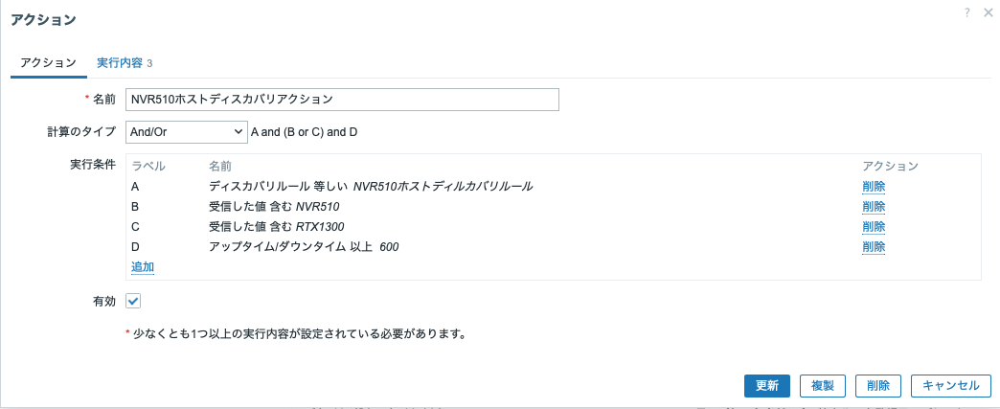アクション/アクションタブ


#### 「実行内容」タブ

「ディスカバリ」のルールで見つけてきたホストの候補に対して、
「アクション」タブの条件で絞り込みを行った。
絞り込みの条件に合致したホスト候補について、この「実行内容」タブの内容を実行する。

  アクション/実行内容タブ


| 項目 | 設定内容 |
| ---- | -------|
| ホストを追加 | 監視対象としてホストを登録する。 |
| ホストグループに追加 | 「NVR510ホストグループ」(←あらかじめ作成済み)に追加する。 |
| テンプレートをリンク | 「YAMAHA NVR510 by SNMP」テンプレート(←後述)にリンクする。とりあえずリンクするなら「Network Generic Device by SNMP」でも良い。 |

- これで (ホスト) ディスカバリは完了し、条件にあったノードをZabbix監視対象の登録・ホストグループへの追加・テンプレート適用などの作業を実施したことになる。


## テンプレート作成

前節 (ホスト) ディスカバリで、条件に合うノードを監視対象として登録し、テンプレートを適用するところまではできた。
本節では、そのテンプレートを作成する。

### テンプレートの初期作成

テンプレートは、「Zabbix/データ収集/テンプレート」で「テンプレートの作成」をクリックして作成する。
とりあえず、「YAMAHA NVR510 by SNMP」というテンプレートを作成したのが次の図である。

  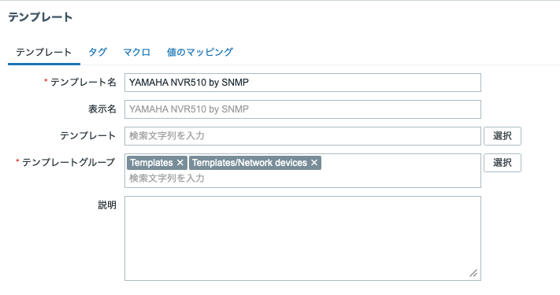YAMAHA NVR510 by SNMP テンプレート作成

| 項目 | 設定内容 |
| ---- | -------|
| テンプレート名 | 適宜、名前を付ける。 |
| 表示名 | 日本語の名前を付けるとかならここへ書く。ここでは空欄にしたのでテンプレート名に同じ。 |
| テンプレート | ここでは空欄にした。既存のテンプレート名を書くと、そのテンプレートから項目などを継承するみたい。 |
| テンプレートグループ | このテンプレートが属するテンプレートグループを指定。すべてのテンプレートがTemplatesグループに所属する慣習のようなのでそれを書いておくのと、ネットワークデバイス用のテンプレートだよなということで Templates/Network devices を書いておく。 |
| 説明 | 良い子は説明をしっかり書きましょう。 |

これで、Zabbix/データ収集/テンプレートに「YAMAHA NVR510 by SNMP」テンプレートが出現する。(下図。テンプレートはたくさんあるので、絞り込んである。)
ホストが１個発見されているのは、先ほどの(ホスト)ディスカバリで検出され条件に合致したため。

  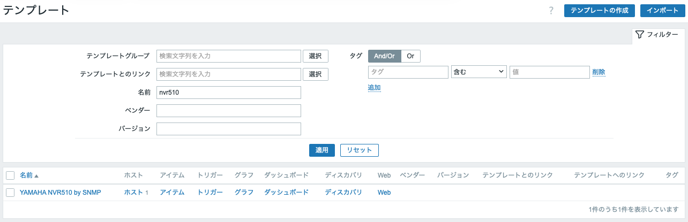作成されたYAMAHA NVR510 by SNMP テンプレート


### アイテム作成

作成した「YAMAHA NVR510 by SNMP」テンプレートにアイテムやその他の要素を追加すれば、監視などができる。
上述の
[NVR510 SNMP MIBリファレンスの標準MIB/systemグループ](https://www.rtpro.yamaha.co.jp/RT/docs/snmp/snmp_mib_nvr510.html#system_group)
を見ると、RFC1213-MIB::sysName (1.3.6.1.2.1.1.5) があるので、これを監視するアイテムを作成してみよう。

まず、sysName をコマンドラインから取得すると次のようになった。

``` shell
$ snmptranslate 1.3.6.1.2.1.1.5
RFC1213-MIB::sysName

$ snmptranslate -Of 1.3.6.1.2.1.1.5
.iso.org.dod.internet.mgmt.mib-2.system.sysName

$ snmpwalk 10.227.0.254 1.3.6.1.2.1.1.5
RFC1213-MIB::sysName.0 = STRING: "myNVR510"
```

これをテンプレートに入れるには、先ほどのテンプレート一覧画面で「Yamaha NVR510 by SNMP」テンプレートの
行にある「アイテム」をクリックした先で「アイテムの作成」ボタンを押してアイテムを作成する。

  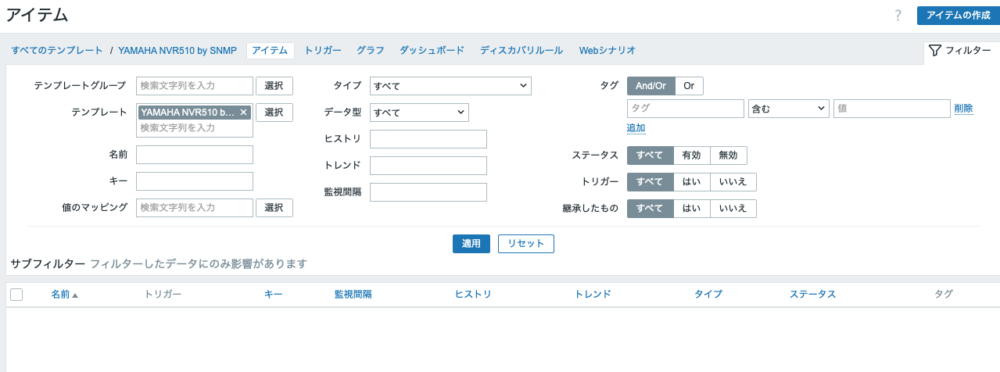「アイテム」をクリックした先の画面

  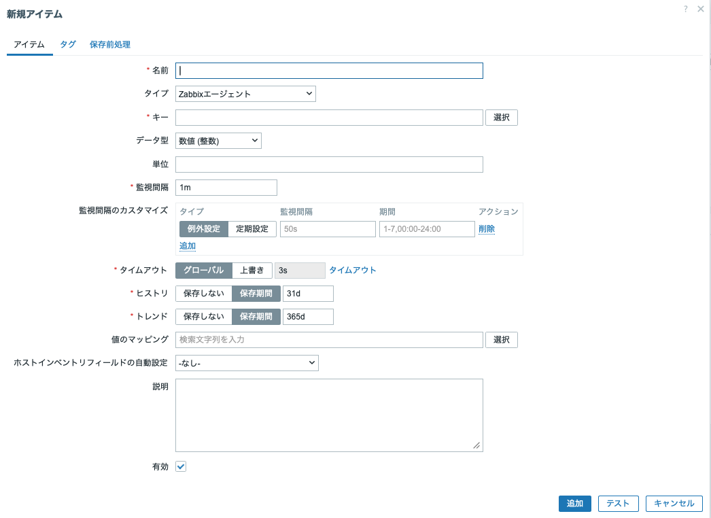そこで「アイテムの作成」ボタンを押した画面

#### 「アイテム」タブ

まずは「アイテム」タブはこんな感じ。

  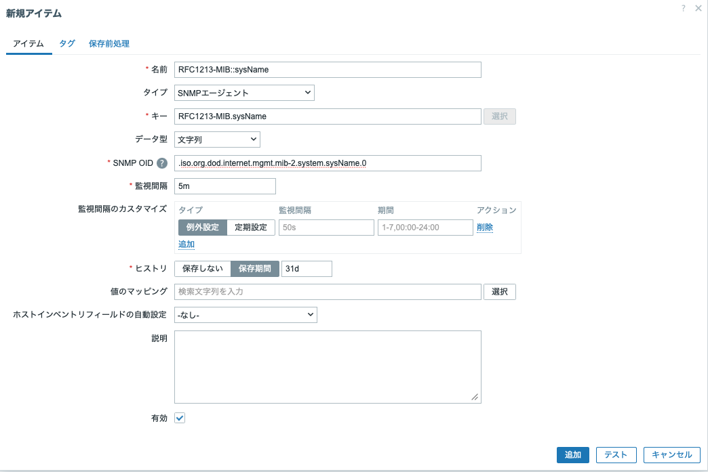アイテムタブ

| 項目 | 設定内容 |
| ---- | -------|
| 名前 | 適宜、名前を付ける。ここでは短い形式のOID名称を付けた。 |
| タイプ | SNMPエージェントを選択。Zabbix側からNVR510へSNMPで値を取得しに行くということ。 |
| キー | 適宜、キーを記述する。同一ホスト内でユニークでなければならないとのこと。また、使える文字種類に制限があるので、OID名称の`::`を`.`に修正してある。 |
| データ型 | `myNVR510` のように文字列が返ってくるので「文字列」。「テキスト」と何が違うんだろう？ |
| SNMP OID | numeric表示でも構わないが、一見して理解しやすいように単語表記にした。末尾に `.0` があるのは、snmpgetで取得できる OID がこれだから。上記のコマンドラインからの例も見て欲しい。 |
| 監視間隔 | ここでは５分にしたが、適切な値にすること。あまり短いとZabbix側も機器側も負荷がかかるので、こんなものでしょう。 |
| 監視感覚のカスタマイズ | 今回はデフォルトのまま。 |
| ヒストリ | 今回はデフォルトのまま。 |
| 値のマッピング | 今回はマッピングしないので、空欄のまま。 |
| ホストインベントリフィールドの自動設定 | 今回はデフォルトのまま |
| 説明 | 書きましょう。 |
| 有効 | チェック状態。 |


#### 「保存前処理」タブ

続いて、「保存前処理」タブで、「指定秒内に変化がなければ破棄」を 3600 秒にしておく。
これはなくてもいいけれど、無いと５分毎にデータを取得してその都度記録していくので、データ領域を消費することになる。
こうしておくと、データに変化がなければ１時間に１個のデータしか書かないので、少し節約できる。

  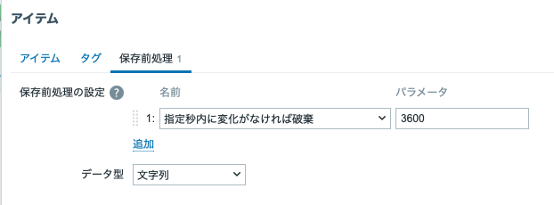保存前処理タブ

| 項目 | 設定内容 |
| ---- | -------|
| 保存前処理の設定 / 1: | 「指定秒内に変化がなければ破棄」を 3600 秒に |

#### アイテム完成

これで RFC1213-MIB::sysName のデータを取得する「アイテム」が完成したので、しばらくするとデータが見えるはず。
Zabbix/監視データ/ホスト で NVR510 (setup.netvolante.jp)の行を見ると、「最新データ」が１個あるのが見える。

  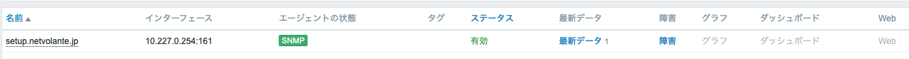NVR510の最新データ１個

「最新データ」をクリックした先は、Zabbix/監視データ/最新データ の画面で NVR510 のアイテム (RFC1213-MIB::sysName) が myNVR510 となっているのがわかる。


  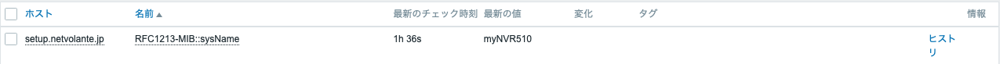RFC1213-MIB::sysNameとして"myNVR510"を観測した図

ホスト当たり１個しかないデータについては、こうやってアイテムを作っておけば、発見したホストに対して自動的に監視が始まるはずである。

### ディスカバリ(LLD)

ホスト当たり１個しかないデータについては、先程のようにアイテムを作っておけば足りるけれど、CPUコアやネットワークインタフェースのようにホスト当たりに複数あるものはディスカバリ(LLD) で対応することもできる。
NVR510には増設カードを挿すような拡張スロットは存在しないので、実はディスカバリ (LLD)を使わずに全部アイテムとして登録しておく作戦もありなのだけれど、サンプルを兼ねてディスカバリ (LLD)をやってみることにしよう。

#### ディスカバリルール (LLD)

[NVR510のMIBのinterfaceグループ](https://www.rtpro.yamaha.co.jp/RT/docs/snmp/snmp_mib_nvr510.html#interface_group)
を見ると、RFC1213-MIB::ifDescr があって「インタフェース名」文字列を取得できることがわかる。
コマンドラインからやると次のようになる。

``` shell
$ snmptranslate -Of 1.3.6.1.2.1.2.2.1.2
.iso.org.dod.internet.mgmt.mib-2.interfaces.ifTable.ifEntry.ifDescr

$ snmptranslate 1.3.6.1.2.1.2.2.1.2
RFC1213-MIB::ifDescr

$ snmpwalk 10.227.0.254 1.3.6.1.2.1.2.2.1.2
RFC1213-MIB::ifDescr.1 = STRING: "LAN1"
RFC1213-MIB::ifDescr.2 = STRING: "LAN2"
RFC1213-MIB::ifDescr.3 = STRING: "ONU1"
RFC1213-MIB::ifDescr.4 = STRING: "WAN1"
RFC1213-MIB::ifDescr.53 = STRING: "NULL"
RFC1213-MIB::ifDescr.54 = STRING: "LOOPBACK1"
RFC1213-MIB::ifDescr.55 = STRING: "LOOPBACK2"
RFC1213-MIB::ifDescr.56 = STRING: "LOOPBACK3"
RFC1213-MIB::ifDescr.57 = STRING: "LOOPBACK4"
RFC1213-MIB::ifDescr.58 = STRING: "LOOPBACK5"
RFC1213-MIB::ifDescr.59 = STRING: "LOOPBACK6"
RFC1213-MIB::ifDescr.60 = STRING: "LOOPBACK7"
RFC1213-MIB::ifDescr.61 = STRING: "LOOPBACK8"
RFC1213-MIB::ifDescr.62 = STRING: "LOOPBACK9"
```

これをディスカバリ (LLD) で検出するには、「ディスカバリルール」(LLD)と「アイテムのプロトタイプ」を作成する必要がある。


Zabbix/データ収集/テンプレート で YAMAHA NVR510 by SNMP テンプレートを探し、「ディスカバリ」(LLD)をクリックすると、
「ディスカばりルール」のページになるので、右上「ディスカバリルールの作成」ボタンを押して作成する。

  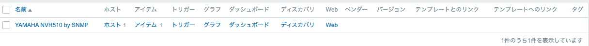YAMAHA NVR510 by SNMPテンプレートで「ディスカバリ」をクリックすると、

  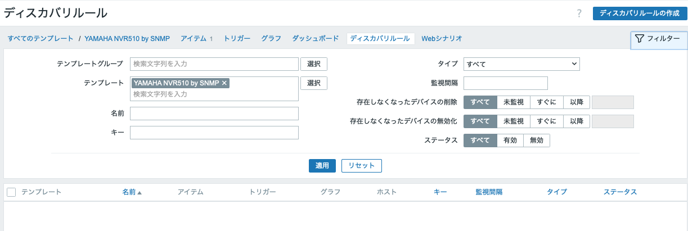ディスカバリルール画面になるので右上「ディスカバリルールの作成」ボタンをクリックしてディスカバリルールを作成する。

ディスカバリルールを設定する画面にはいくつかのタブがあるので、順番に設定を見ていこう。

#### ディスカバリルール/ディスカバリルールタブ

まず「ディスカバリルール」タブでは、ディスカバリルールの名前やどんな方法 (ここではSNMP) で何を取りに行くのかといった設定を行う。

  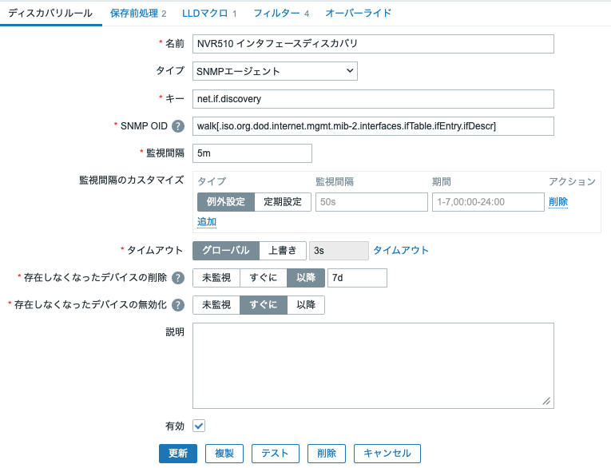ディスカバリルール作成/ディスカバリルールタブ

| 項目 | 設定内容 |
| ---- | ------ |
| 名前 | 適宜名前を付ける。ここでは「NVR510 インタフェースディスカバリ」 |
| タイプ | SNMP エージェント |
| キー | 適宜キーを指定する。慣例に従うと 「net.if.discvoery」でよいらしい。 |
| SNMP OID | RFC1213-MIB::ifDescr を snmpwalk せよ、の意。 |
| 監視感覚 | 試作中なので５分。 |
| その他の項目 | デフォルトのまま。 |

#### ディスカバリルール/保存前処理タブ

次に「保存前処理」タブでは、SNMP walk の結果として得たデータを前処理する。

- JSON の形に変換
- マクロ IFDESCR に RFC1213-MIB::ifDescr の値を格納
- １時間以内に変化がなければ破棄

上で見たように、SNMP walk の結果としては `RFC1213-MIB::ifDescr.1 = STRING: "LAN1"` のような行が複数返されるわけだが、
  - `RFC1213-MIB::ifDescr.1` の `1` の部分が {#SNMPINDEX} なるマクロに代入され、
  - {#SNMPINDEX} の値に対応するマクロ IFDESCR に値 LAN1 が代入される

という動きになるみたい。
そして、後述の「アイテムのプロトタイプ」をインスタンス化する(?)際には、{#SNMPINDEX}の全てについて対応するマクロ {#IFDESCR} の値をそれぞれ取り出して使える、という動きになるみたい。
要注意なのは、ここで定義したマクロは IFDESCR でしかなくて、それを {#IFDESCR} に代入する処理は、次の「LLDマクロ」タブでの設定によるという点かな。
ややこしい上に、タイポしてもエラーメッセージが出るわけじゃないのでデバッグには途方に暮れるしかないんだけど、どうもそういうことらしい。

  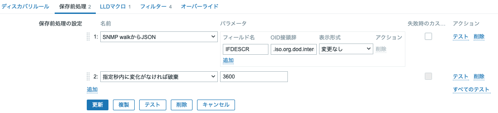ディスカバリルール作成/保存前処理タブ

#### ディスカバリルールの「テスト」

ここで、ディスカバリルールタブと保存前処理タブでの設定内容のテストをやってみる。
両タブの下部に「更新・複製・テスト・削除・キャンセル」と並んでいる中の「テスト」ボタンを押して実施する。
NVR510ホストのIPアドレスやポート番号やSNMPコミュニティを記入して「値の取得とテスト」ボタンを押せば実行できる。

  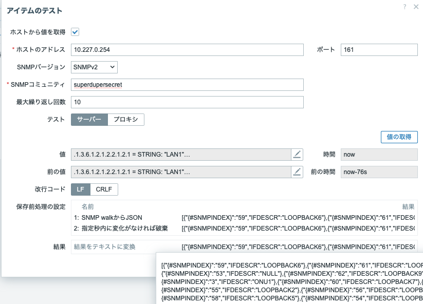ディスカバリルール作成のテスト

画面の下の方に、JSONの配列があって、 {#SNMPINDEX}とIFDESCRの対にそれぞれ値が入っていることが読み取れると思うが、これがここまでの設定で指定してきた内容である。


